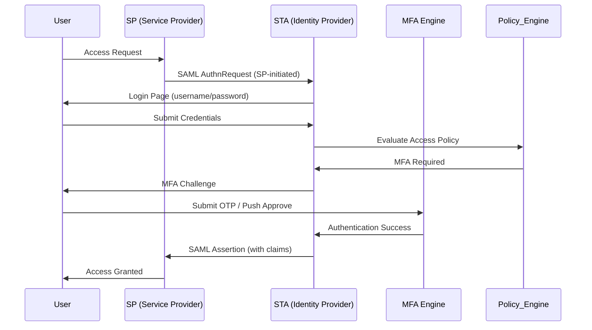
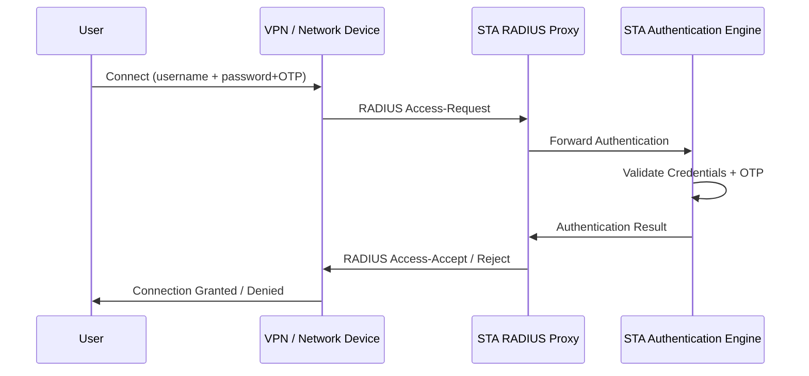
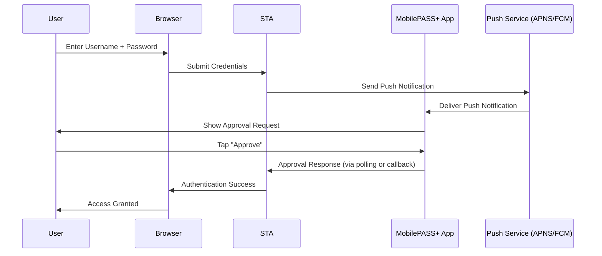
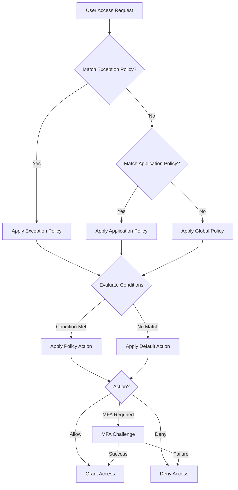
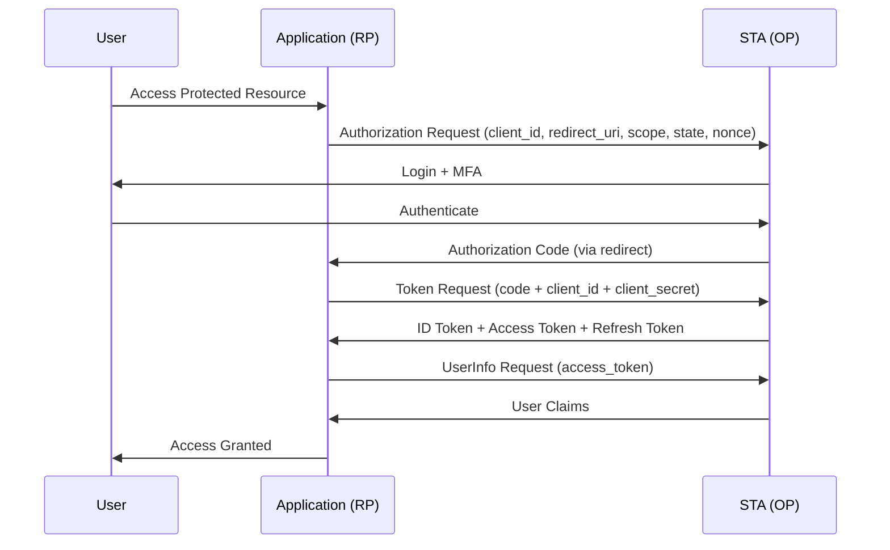

# SafeNet Trusted Access (STA) — Complete Documentation

> **Base de Conhecimento Consolidada para RAG, Embeddings e Sistemas de IA**
> Fonte principal: https://www.thalesdocs.com/sta/
> Consolidado em: 2026-05-29
> © Copyright 2019-2026, Thales Group

---

## Table of Contents

1. [Introduction and Product Overview](#1-introduction-and-product-overview)
2. [Architecture and Concepts](#2-architecture-and-concepts)
3. [Getting Started](#3-getting-started)
4. [Users and Groups](#4-users-and-groups)
5. [User Provisioning](#5-user-provisioning)
6. [Operators and Roles](#6-operators-and-roles)
7. [Tokens and MFA](#7-tokens-and-mfa)
8. [Push OTP (MobilePASS+)](#8-push-otp-mobilepass)
9. [Access Policies](#9-access-policies)
10. [Applications — SAML, OIDC, and Integrations](#10-applications--saml-oidc-and-integrations)
11. [Authentication Methods](#11-authentication-methods)
12. [RADIUS Integrations](#12-radius-integrations)
13. [Server and Agent Settings](#13-server-and-agent-settings)
14. [User Self-Service](#14-user-self-service)
15. [Branding and Language Customization](#15-branding-and-language-customization)
16. [Dashboard, Logs, and Audit](#16-dashboard-logs-and-audit)
17. [Reports](#17-reports)
18. [Identity Governance and Administration](#18-identity-governance-and-administration)
19. [Security Integrations](#19-security-integrations)
20. [SafeNet Agents](#20-safenet-agents)
21. [SafeNet MobilePASS+](#21-safenet-mobilepass)
22. [API References — Overview and API Keys](#22-api-references--overview-and-api-keys)
23. [REST API for STA](#23-rest-api-for-sta)
24. [SCIM API for STA](#24-scim-api-for-sta)
25. [BSIDCA API](#25-bsidca-api)
26. [Account Management](#26-account-management)
27. [Compliance and Standards](#27-compliance-and-standards)
28. [Release Notes Summary](#28-release-notes-summary)
29. [Troubleshooting](#29-troubleshooting)
30. [Glossary and Key Terms](#30-glossary-and-key-terms)

---

## 1. Introduction and Product Overview

> Fonte: https://www.thalesdocs.com/sta/

**SafeNet Trusted Access (STA)** is a cloud-based Identity and Access Management (IAM) service developed by Thales Group. It provides Multi-Factor Authentication (MFA), Single Sign-On (SSO), and access management capabilities for cloud and on-premises applications.

### What is SafeNet Trusted Access?

SafeNet Trusted Access (STA) is a cloud-based access management service that provides:

- **Multi-Factor Authentication (MFA)**: Secure authentication using hardware tokens, software tokens (MobilePASS+), FIDO2, push OTP, SMS OTP, email OTP, voice OTP, certificates, and GrIDsure patterns.
- **Single Sign-On (SSO)**: Centralized authentication across all cloud and on-premises applications using SAML 2.0 and OIDC/OAuth 2.0.
- **Access Management**: Context-aware, policy-based access control with conditional access rules.
- **Federation**: Identity federation using SAML 2.0 and OIDC to connect with enterprise identity providers (IdPs).
- **Zero Trust Architecture**: Continuous verification and context-based trust decisions for every access request.
- **User Provisioning**: Automated user lifecycle management via SCIM 2.0, Active Directory synchronization, and Identity Management Framework (IdM).

### Key Capabilities

| Capability | Description |
|---|---|
| MFA | OTP tokens, push notifications, FIDO2, certificates, GrIDsure |
| SSO | SAML 2.0, OIDC/OAuth 2.0 federation |
| Access Policies | Contextual, conditional, scenario-based rules |
| User Provisioning | SCIM 2.0, Azure AD sync, IdM Framework, CSV |
| APIs | REST API, SCIM API, BSIDCA SOAP API |
| SafeNet Agents | FreeRADIUS, NPS, Windows Logon, macOS Logon, OWA, App Gateway |
| Reporting | Audit logs, compliance reports, access logs, SIEM integration |

### Service Zones

STA is available in three service zones:

| Service Zone | Description |
|---|---|
| Classic Service Zone | Original STA service zone |
| EU Service Zone | European Union data residency |
| US Service Zone | United States data residency |

Each zone has its own release notes and may have different feature availability timelines.

### Documentation Structure

The STA documentation is organized into the following sections:

- **SafeNet Trusted Access (Operator)**: Administration and configuration
- **SafeNet Agents**: On-premises agents for extended functionality
- **SafeNet MobilePASS+**: Mobile authenticator application documentation
- **API References**: REST, SCIM, and BSIDCA API documentation
- **Account Management**: Service provider and tenant management
- **Release Notes**: Per-zone and per-component changelogs

---

## 2. Architecture and Concepts

### High-Level Architecture

```mermaid
graph TB
    User[User / Browser] --> STA_Login[STA Login Page]
    STA_Login --> STA_Engine[STA Access Management Engine]
    STA_Engine --> MFA_Engine[MFA Engine]
    STA_Engine --> Policy_Engine[Policy Engine]
    STA_Engine --> IdP_Connector[Identity Provider Connector]
    STA_Engine --> App_Connector[Application Connector]

    MFA_Engine --> Token_DB[Token Database]
    MFA_Engine --> Push_Service[Push Notification Service]

    IdP_Connector --> ActiveDirectory[Active Directory]
    IdP_Connector --> AzureAD[Microsoft Entra ID]
    IdP_Connector --> ADFS[ADFS]

    App_Connector --> SAML_Apps[SAML Applications]
    App_Connector --> OIDC_Apps[OIDC Applications]
    App_Connector --> RADIUS_Clients[RADIUS Clients]

    STA_Engine --> STA_Console[STA Token Management Console]
    STA_Engine --> STA_AM_Console[STA Access Management Console]

    style STA_Engine fill:#2E4057
    style MFA_Engine fill:#048A81
    style Policy_Engine fill:#048A81
```



### Core Concepts

#### Virtual Server (Tenant)

A **Virtual Server** (also called a **Tenant**) in STA represents an isolated instance of the STA service for an organization. Each virtual server:

- Has a unique **Tenant Code** (e.g., `6AFDW7GR6I`) — a short alphanumeric identifier used in API calls.
- Has its own users, groups, tokens, applications, and access policies.
- Has its own API keys for programmatic access.
- Can be nested under an account hierarchy (parent accounts → child accounts).

#### STA Consoles

STA provides two management consoles:

1. **STA Token Management Console**: For managing tokens, users, provisioning, and traditional MFA operations. Used primarily for token lifecycle management.
2. **STA Access Management Console**: For managing access policies, SSO applications, SAML/OIDC integrations, API keys, and cloud identity features.

#### Authentication Flow (SAML SSO)



#### Authentication Flow (RADIUS)



### Key Terms

| Term | Definition |
|---|---|
| Tenant Code | Unique alphanumeric identifier for a virtual server (e.g., `6AFDW7GR6I`). Used in all API calls. |
| Virtual Server | An isolated STA instance for an organization; synonymous with "tenant" |
| Operator | An administrative user who manages STA. Can have global or scoped roles. |
| Service Account | A user account associated with an API key, used for programmatic API access |
| Token | An authentication credential — hardware or software — that generates OTPs |
| Enrollment | The process by which a user activates and registers a token |
| Provisioning | Automated assignment of tokens to users based on rules |
| Access Policy | A rule set that determines what authentication is required to access an application |
| Scenario | A named set of conditions (e.g., network zone, device type) used in policies |
| Assertion | A SAML XML document issued by STA (as IdP) asserting the user's identity to an SP |
| Claim | An attribute or piece of user information included in a SAML assertion or OIDC token |
| SCIM | System for Cross-domain Identity Management — standard protocol for user provisioning |

---

## 3. Getting Started

> Fonte: https://www.thalesdocs.com/sta/operator/get_start/index.html

### Subscription Plans

STA offers multiple subscription plans that determine available features, token types, and capacity. Plans include different levels of MFA methods, application integrations, and API access.

### Logging In to the STA Consoles

The STA Token Management Console and STA Access Management Console are accessed via web browser. Initial login requires credentials provided during account setup.

**STA Access Management Console URL pattern:**
```
https://sta.safenet-inc.com/<tenantCode>/
```

**STA Token Management Console URL pattern:**
```
https://bsidca.safenet-inc.com/<tenantCode>/
```

> Note: The exact URLs depend on your service zone (Classic, EU, or US). Check your welcome email or account documentation for the correct base URLs.

### Initial Setup Checklist

1. **Log in** to the STA Token Management Console and STA Access Management Console.
2. **Configure your virtual server**: Set up the tenant name, email settings, and branding.
3. **Create users**: Import or create user accounts manually, via SCIM, or via directory synchronization.
4. **Provision tokens**: Assign MFA tokens to users — hardware tokens or MobilePASS+ software tokens.
5. **Add applications**: Configure SAML or OIDC applications for SSO.
6. **Set access policies**: Define what authentication strength is required per application or scenario.
7. **Test authentication**: Verify end-to-end login flow for at least one application.
8. **Configure agents** (if needed): Install SafeNet Agents for RADIUS, Windows Logon, NPS, etc.
9. **Enable log streaming**: Configure audit and access logs for SIEM integration.

### STA Consoles Overview

| Console | Purpose | Key Features |
|---|---|---|
| Token Management Console | Token and user lifecycle | Assign/revoke tokens, manage PINs, provisioning rules |
| Access Management Console | SSO and policy management | Applications, access policies, API keys, audit logs |

---

## 4. Users and Groups

> Fonte: https://www.thalesdocs.com/sta/operator/users/index.html

### User Types

STA supports two main types of users:

| Type | Description |
|---|---|
| Internal Users | Users created directly in STA, stored in the STA user directory |
| External Users | Users that are synchronized from an external identity source (Active Directory, Azure AD, SCIM) |

### User Attributes

Each STA user has the following key attributes:

| Attribute | Description | Constraints |
|---|---|---|
| User Name (userName) | Unique login identifier | Max 64 characters |
| First Name (givenName) | User's given name | Max 64 characters |
| Last Name (familyName) | User's family name | Max 64 characters |
| Email | Primary email address | Max 96 characters |
| Phone (mobile) | Mobile phone number | Used for SMS OTP |
| Phone (work) | Work phone number | Secondary contact |
| Active | Account status (active/suspended) | Boolean |
| alias1–alias4 | Alternative identifiers for RADIUS or external systems | Max 64 characters each |
| userPrincipalName | UPN for Azure AD integration | Max 256 characters |
| immutableId | Immutable identifier for Azure AD sync | UUID format |
| custom1–custom3 | Custom attributes for organizational data | Max 256 characters each |

### Managing Users

**Create a user** (STA Access Management Console):
1. Navigate to **Users** > **Add User**.
2. Enter required fields: User Name, First Name, Last Name, Email.
3. Optionally set aliases, custom attributes, and group memberships.
4. Save the user.

**Account States:**

| State | Description |
|---|---|
| Active | User can authenticate normally |
| Suspended | User account disabled; cannot authenticate |
| Locked | Account temporarily locked after failed authentication attempts |

### Groups

Groups in STA are used to:
- Apply access policies to multiple users.
- Automate token provisioning rules.
- Assign operator roles to sets of users.
- Control application access.

**Group Types:**

| Type | Description |
|---|---|
| Static Group | Members are added manually |
| Dynamic Group | Members are determined by rules (LDAP attributes, etc.) |
| Synchronized Group | Synchronized from Active Directory or Azure AD |

### Containers

Containers are organizational units within STA (equivalent to OUs in Active Directory) that help organize users hierarchically. Containers can be used to delegate administrative rights to specific portions of the user directory.

### Account Lockout Policies

STA supports configurable lockout policies:

- **Maximum failed login attempts**: Number of consecutive failures before lockout.
- **Lockout duration**: How long the account remains locked.
- **Auto-unlock**: Automatic unlock after the lockout duration expires.
- **Manual unlock**: Operator can unlock the account from the console.

### Access Restrictions by Time/Date

Operators can restrict user authentication based on:
- **Time of day**: Allow/deny access during specific hours.
- **Day of week**: Allow/deny access on specific days.
- **Date ranges**: Temporary access windows.

---

## 5. User Provisioning

> Fonte: https://www.thalesdocs.com/sta/operator/user_synchronization/index.html

### Provisioning Methods

STA supports multiple user provisioning methods:

| Method | Description | Best For |
|---|---|---|
| Microsoft Entra ID (Azure AD) Sync | Native sync with Azure AD using Microsoft Graph API | Organizations using Microsoft 365 / Azure AD |
| Identity Management Framework (IdM) | Thales-provided connector framework | Complex sync scenarios, multiple sources |
| SCIM 2.0 | Standard SCIM protocol for inbound provisioning | Cloud identity providers (Okta, miniOrange) |
| Manual Creation | Create users one at a time in the console | Small deployments, test users |
| REST API | Programmatic user creation via REST API | Custom integrations, automation |

### Microsoft Entra ID Synchronization

> Fonte: https://www.thalesdocs.com/sta/operator/user_synchronization/azure_directory_sync/index.html

STA can synchronize users directly from Microsoft Entra ID (formerly Azure Active Directory):

1. **Pre-requisites**: Azure AD tenant, appropriate permissions, Entra ID application registration in Azure.
2. **Configure in STA**: Enter Azure AD tenant ID, client ID, and client secret.
3. **Map attributes**: Define which Azure AD attributes map to STA user fields.
4. **Schedule sync**: Configure sync frequency (on-demand or scheduled).
5. **Immutable IDs**: For proper linking, configure immutableId in both Azure AD and STA.

**Adding Immutable IDs to users in Microsoft Entra ID:**

The immutableId attribute ensures that a user account in STA is correctly linked to the corresponding Azure AD user, even if the username changes.

```powershell
# PowerShell: Set ImmutableId in Azure AD for user synchronization
# Using Microsoft Graph PowerShell module
$user = Get-MgUser -UserId "user@example.com"
$immutableId = [Convert]::ToBase64String([Guid]::NewGuid().ToByteArray())
Update-MgUser -UserId $user.Id -OnPremisesImmutableId $immutableId
```

### Identity Management Framework (IdM)

The Identity Management Framework (IdM) is a Thales-provided connector that enables sophisticated user synchronization:

**Supported Identity Sources:**

| Source | Description |
|---|---|
| Active Directory (AD) | On-premises Windows Active Directory |
| Microsoft Entra ID | Azure Active Directory / Microsoft 365 |
| CSV Files | Comma-separated value files for bulk import |
| Custom Sources | Via connector development |

**IdM Features:**
- **Bi-directional synchronization**: STA can push changes back to the identity source.
- **Attribute mapping**: Flexible mapping between source and STA attributes.
- **Transformation rules**: Apply transformations to attribute values during sync.
- **Filtering**: Include/exclude users based on attribute conditions.
- **Delta sync**: Only sync changed records to minimize processing.

**IdM Deployment:**

The IdM Framework is deployed as an on-premises component that connects to both your identity source and STA cloud service:

```
[Identity Source (AD/CSV/Entra ID)] → [IdM Connector (on-prem)] → [STA Cloud]
```

### User Provisioning via Okta (SCIM)

> Fonte: https://www.thalesdocs.com/sta/operator/user_synchronization/user_provisioning_through_okta/index.html

STA accepts inbound SCIM 2.0 provisioning from Okta:

1. In Okta, create a custom SCIM application pointing to STA's SCIM endpoint.
2. Configure the SCIM base URL: `https://api.<STA-server>/tenants/{tenantCode}/scim/v2/`
3. Set authentication: Bearer token (API Key from STA).
4. Map Okta attributes to SCIM attributes.
5. Enable provisioning features: Push Users, Push Groups, Import Users.

### User Provisioning via miniOrange (SCIM)

Similar to Okta integration, miniOrange can provision users to STA via SCIM 2.0. Configure the SCIM endpoint and API key in miniOrange's provisioning settings.

### Multi-Role Accounts

STA supports multi-role accounts, where a single user can have different roles or access levels for different applications. This is particularly useful in environments using Microsoft Entra ID with multiple application roles.

---

## 6. Operators and Roles

> Fonte: https://www.thalesdocs.com/sta/operator/roles/index.html

### Operators

Operators are administrative users who manage STA. Each operator has an assigned role that determines what they can view and modify.

**Operator Types:**

| Type | Description |
|---|---|
| Internal Operators | Operators whose credentials are managed within STA |
| External Operators | Operators who authenticate via an external IdP (SAML/OIDC) |

### Operator Roles

STA provides predefined roles and supports custom roles:

**Predefined Roles:**

| Role | Description |
|---|---|
| Super Operator | Full administrative access to all STA functions |
| Operator | Standard administrative access, excluding system-level settings |
| Help Desk | Can manage users and tokens, but not system configuration |
| Read Only | View-only access to STA data |

**Role Permissions Include:**
- User management (create, modify, delete, lock/unlock)
- Token management (assign, revoke, initialize)
- Application management (add, configure applications)
- Policy management (create, modify access policies)
- Report access (view audit logs, reports)
- System settings (email, SMS, RADIUS configuration)
- API key management

### External Operators

External operators authenticate using an external Identity Provider (IdP). This enables:
- Federated single sign-on for administrators.
- Use of existing corporate credentials for STA administration.
- MFA enforcement for operator login.

### Automatic Role Provisioning

STA can automatically assign operator roles based on group membership:

1. Define a role provisioning rule linked to a group.
2. When a user is added to the group, they are automatically assigned the associated operator role.
3. When removed from the group, the role is revoked.

### Alerts

Operators can configure alerts for specific events:
- Authentication failures above a threshold.
- Account lockouts.
- Token provisioning failures.
- System health issues.

Alerts can be delivered via email to designated operator addresses.

---

## 7. Tokens and MFA

> Fonte: https://www.thalesdocs.com/sta/operator/tokens/index.html

### Token Types

STA supports a wide variety of authentication tokens:

| Token Type | Description | Form Factor |
|---|---|---|
| MobilePASS+ | Thales software token app | iOS, Android, Windows, macOS, Chrome OS, watchOS |
| Hardware OATH | TOTP/HOTP hardware tokens (Thales branded) | Physical key fob |
| GrIDsure | Pattern-based authentication (grid challenge) | Software |
| GemOTP / SafeNet OTP 110 | OATH hardware tokens | Physical device |
| eToken | USB-based smart card token | USB device |
| SMS OTP | One-time passcode delivered via SMS | Mobile phone |
| Email OTP | One-time passcode delivered via email | Email client |
| Voice OTP | One-time passcode delivered via phone call | Any phone |
| YubiKey | Third-party OATH-compatible token | USB/NFC key |
| FIDO2 | WebAuthn/FIDO2 authenticators | Hardware security key, platform authenticator |
| Certificate | X.509 certificate-based authentication | Smart card, TPM |
| Push OTP | Push notification approval via MobilePASS+ | Mobile app |

### Token Allocations

Token allocations define the pool of tokens available for assignment:
- Each virtual server has a token inventory.
- Tokens are allocated from the account manager to virtual servers.
- Track usage in the Token Inventory report.

### Token Templates

Token templates define default settings for token provisioning:
- Token type
- PIN requirements
- OTP length
- Time step (for TOTP)
- Algorithm (SHA-1, SHA-256)
- Auto-enrollment settings

### Token Restrictions

Restrictions control how tokens can be used:
- Time-based restrictions (allowed hours/days for OTP authentication)
- IP restrictions (only allow OTP from specific IPs)
- Failed attempt limits

### Server-Side PINs

STA supports server-side PINs, where the PIN is stored on the STA server rather than the token:
- More secure than device-side PINs.
- PIN is concatenated with the OTP during authentication.
- PIN policy: minimum/maximum length, complexity requirements, expiry.

### Token Synchronization

If a TOTP token drifts out of sync with the server's time, STA supports automatic and manual resynchronization:
- **Auto-sync**: STA automatically adjusts its time window for the token.
- **Manual sync**: Operator initiates sync from the console using two consecutive OTPs.

### Token Authentication

Authentication with OTP tokens:
- User enters username + (PIN +) OTP.
- STA validates the OTP against the token's algorithm and seed.
- For TOTP: validates within the allowed time window (±N steps).
- For HOTP: validates within the allowed counter window.

### Importing SafeNet Hardware Tokens

Hardware tokens are imported via PSKC (Portable Symmetric Key Container) files:

```xml
<!-- Example PSKC token import structure -->
<KeyContainer Version="1.0" xmlns="urn:ietf:params:xml:ns:keyprov:pskc">
  <KeyPackage>
    <DeviceInfo>
      <Manufacturer>Thales</Manufacturer>
      <SerialNo>1234567890</SerialNo>
    </DeviceInfo>
    <Key Id="1234567890" Algorithm="urn:ietf:params:xml:ns:keyprov:pskc:totp">
      <Issuer>STA</Issuer>
      <AlgorithmParameters>
        <ResponseFormat Length="6" Encoding="DECIMAL"/>
      </AlgorithmParameters>
      <Data>
        <Secret>
          <PlainValue>BASE64ENCODEDSEED==</PlainValue>
        </Secret>
        <Time><PlainValue>0</PlainValue></Time>
        <TimeInterval><PlainValue>30</PlainValue></TimeInterval>
      </Data>
    </Key>
  </KeyPackage>
</KeyContainer>
```

### Importing YubiKey Tokens

YubiKey tokens (in OATH-TOTP or OATH-HOTP mode) can be imported:
1. Export the YubiKey seed from YubiKey Manager or factory provisioning.
2. Import the PSKC file into STA token inventory.
3. Assign to users.

### SMS, Email, and Voice OTP

STA supports OTP delivery via out-of-band channels:

**SMS OTP:**
- Requires configured SMS provider (Twilio, custom gateway).
- User receives 6-digit OTP via SMS to registered mobile number.
- Valid for a configurable time window.
- SMS credits are managed in account inventory.

**Email OTP:**
- Requires configured SMTP server.
- User receives OTP via email.
- Suitable for users without smartphones.

**Voice OTP:**
- Requires configured voice provider.
- OTP is read aloud via automated phone call.
- Supports multiple languages.

### GrIDsure Authentication

GrIDsure uses a pattern-based challenge:
1. User sets a personal pattern (a sequence of cells on a grid).
2. At authentication, a grid is presented with random characters.
3. User reads off the characters at their pattern positions as the OTP.

### Quicklog Authentication

Quicklog (multi-mode) authentication allows users to choose their preferred authentication method at login time (e.g., OTP or push notification).

### MobilePASS+ Self-Provisioning

Users can self-enroll MobilePASS+ tokens without operator intervention:
1. Operator enables self-provisioning for the user or group.
2. User accesses the self-provisioning portal.
3. User downloads MobilePASS+ app and scans QR code or enters activation code.
4. Token is immediately active.

---

## 8. Push OTP (MobilePASS+)

> Fonte: https://www.thalesdocs.com/sta/operator/push/index.html

### Push OTP Overview

Push OTP is an authentication method where STA sends a push notification to the user's mobile device. The user approves or denies the authentication request with a single tap.

### Requirements for Push OTP

- User must have SafeNet MobilePASS+ installed on their device (iOS or Android).
- Device must have internet connectivity to receive push notifications.
- STA must have Push OTP enabled in the tenant settings.
- Application must be configured to support push OTP.

**Supported Platforms:**
- iOS (iPhone, iPad)
- Android

**Not Supported:**
- MobilePASS+ for Windows (no push support)
- MobilePASS+ for macOS (no push support)
- MobilePASS+ for Chrome OS (no push support)

### Enabling Push OTP

1. In STA Token Management Console, navigate to **Tokens** > **MobilePASS Target and Push OTP Settings**.
2. Enable Push OTP.
3. Configure the push notification service settings.

### Push OTP Rejection Policy

When a user receives a fraudulent push notification, they can reject it. STA tracks rejections:

- Configurable threshold: After N consecutive rejections, the account is automatically locked.
- This protects against MFA fatigue attacks.

### Push OTP Authentication Flow



### Customizing Push Notifications

Administrators can customize push notification content:
- Notification title
- Notification message body
- Include application name in notification
- Include context information (IP address, location)

---

## 9. Access Policies

> Fonte: https://www.thalesdocs.com/sta/operator/policies/index.html

### Access Policy Overview

Access policies in STA define the authentication requirements for accessing applications. Policies are evaluated when a user attempts to authenticate to an application.

### Policy Hierarchy

1. **Global Access Policy**: Applied to all users and all applications by default.
2. **Application-Level Policies**: Override the global policy for specific applications.
3. **Exception Policies**: Override policies for specific user groups.

### Global Access Policy

The global access policy defines the default authentication requirement for all access:
- **No Authentication Required**: Users can access without MFA.
- **Password Only**: Standard password authentication.
- **MFA Required**: Always require a second factor.
- **Adaptive**: Apply MFA only under certain conditions.

### Policy Scenarios and Conditions

> Fonte: https://www.thalesdocs.com/sta/operator/policies/plcy_scnrio/index.html

Policies use **scenarios** to define conditions under which different authentication requirements apply.

**Available Condition Types:**

| Condition | Description | Example |
|---|---|---|
| Network Zone | IP address or IP range | Corporate network: 10.0.0.0/8 |
| Device Trust | Device certificate or registration status | Managed corporate device |
| Geolocation | Country or region of access | Allow only from US and Canada |
| Time/Date | Day, time window, or date range | Business hours: Mon-Fri 08:00-18:00 |
| Group Membership | User belongs to specific group | VPN Users group |
| Authentication Level | Already authenticated with specific method | SSO from existing session |
| IP Reputation | Known malicious IP | Tor exit node |
| Browser/OS | User-agent information | Chrome on Windows |

**Policy Actions:**

| Action | Description |
|---|---|
| Allow (No Auth) | Grant access without any authentication |
| Allow (Password) | Require password authentication only |
| Allow (OTP) | Require one-time password (MFA) |
| Allow (Push) | Require push OTP approval |
| Allow (FIDO) | Require FIDO2 authentication |
| Allow (Certificate) | Require certificate-based authentication |
| Deny | Block access entirely |
| Challenge | Step-up authentication to a higher level |

### Policy Evaluation Flow



### Adding a Policy

1. Navigate to **Applications** > select the application > **Access Policy**.
2. Click **Add Policy** or **Add Exception**.
3. Define conditions (scenarios).
4. Specify the authentication action required.
5. Optionally specify the user groups this policy applies to.
6. Set policy priority (if multiple policies apply).
7. Save.

### Logon Policies

Logon policies control the login experience at the STA login page:
- **Password reset**: Allow/disallow self-service password reset from login page.
- **Token enrollment**: Allow/disallow self-enrollment from login page.
- **Step-up authentication**: Allow/disallow session-level step-up.

### Pre-Authentication Rules

Pre-authentication rules evaluate conditions before the user is prompted for credentials:
- Block access from certain IP ranges before even showing the login page.
- Redirect users to different authentication paths based on network zone.
- Show/hide authentication options based on context.

### Granting or Denying Access by Group

Policies can include group-based access rules:
- **Allow only**: Only users in the specified group can access the application.
- **Deny only**: Users in the specified group are denied access.
- **Require MFA for group**: Apply MFA requirement only to specific groups.

---

## 10. Applications — SAML, OIDC, and Integrations

> Fonte: https://www.thalesdocs.com/sta/operator/applications/index.html

### Application Types

STA supports the following types of application integrations:

| Type | Protocol | Use Case |
|---|---|---|
| SAML Applications | SAML 2.0 | Pre-built integrations for popular apps |
| Custom SAML | SAML 2.0 | Any SAML 2.0 compatible application |
| OIDC Applications | OIDC/OAuth 2.0 | Pre-built integrations for OIDC apps |
| Custom OIDC | OIDC/OAuth 2.0 | Any OIDC-compatible application |
| SafeNet Agents | RADIUS, proxy | On-premises apps, VPNs, Windows Logon |
| Office 365 Federation | SAML / WS-Federation | Microsoft Office 365 |

### User Portal

The User Portal is the STA-hosted application launcher where users can access all their assigned applications from a single dashboard. It provides:
- Tile-based application list.
- Application search.
- Last-used applications.
- Customizable branding.

**User Portal URL:**
```
https://<STA-server>/<tenantCode>/portal
```

### SAML Applications

> Fonte: https://www.thalesdocs.com/sta/operator/applications/apps_saml/index.html

STA provides pre-built SAML connectors for popular applications including:
- Salesforce
- Google Workspace
- Office 365
- ServiceNow
- Dropbox Business
- Box
- AWS (Amazon Web Services)
- Many others

For each pre-built SAML application, STA provides:
- Template configuration with default attribute mappings.
- Setup guide with step-by-step configuration.
- Required SAML parameters pre-filled.

### Custom SAML Applications

> Fonte: https://www.thalesdocs.com/sta/operator/applications/apps_gnrc/index.html

For any SAML 2.0-compatible application not available as a pre-built template.

**SAML Configuration Parameters:**

| Parameter | Description | Example |
|---|---|---|
| Entity ID / Issuer | STA's unique identifier as IdP | `https://sta.safenet-inc.com/<tenantCode>` |
| SSO URL / SAML Endpoint | URL where STA sends SAML assertions | Provided by STA console |
| SP Entity ID | Service Provider's unique identifier | `https://app.example.com/saml/metadata` |
| ACS URL | Assertion Consumer Service URL | `https://app.example.com/saml/acs` |
| Binding | HTTP-POST (standard) or HTTP-Redirect | HTTP-POST |
| NameID Format | Format of user identifier in assertion | `urn:oasis:names:tc:SAML:1.1:nameid-format:emailAddress` |
| Signing | Whether STA signs the assertion | Enabled (SHA-256) |
| Encryption | Whether assertion is encrypted | Optional |
| Attribute Statements | User attributes included in assertion | email, firstName, lastName, groups |

**SAML Metadata:**

STA provides a SAML metadata XML file at:
```
https://api.<STA-server>/tenants/<tenantCode>/saml/metadata
```

This metadata file contains:
- Entity ID
- SSO URLs
- Signing certificate (public key)
- NameID formats supported

**Typical Attribute Mappings:**

```xml
<saml:AttributeStatement>
  <saml:Attribute Name="email">
    <saml:AttributeValue>user@example.com</saml:AttributeValue>
  </saml:Attribute>
  <saml:Attribute Name="firstName">
    <saml:AttributeValue>John</saml:AttributeValue>
  </saml:Attribute>
  <saml:Attribute Name="lastName">
    <saml:AttributeValue>Doe</saml:AttributeValue>
  </saml:Attribute>
  <saml:Attribute Name="groups">
    <saml:AttributeValue>SalesTeam</saml:AttributeValue>
    <saml:AttributeValue>Managers</saml:AttributeValue>
  </saml:Attribute>
</saml:AttributeStatement>
```

### Custom OIDC Applications

> Fonte: https://www.thalesdocs.com/sta/operator/applications/apps_oidc-gnrc/index.html

For any OpenID Connect/OAuth 2.0-compatible application.

**OIDC Configuration Parameters:**

| Parameter | Description | Example |
|---|---|---|
| Client ID | Unique identifier for the OIDC application in STA | Auto-generated by STA |
| Client Secret | Shared secret for confidential clients | Auto-generated by STA |
| Redirect URIs | Allowed callback URIs after authentication | `https://app.example.com/callback` |
| Scopes | Requested OIDC scopes | `openid profile email` |
| Grant Types | OAuth 2.0 grant types allowed | `authorization_code`, `refresh_token` |
| Response Types | OAuth 2.0 response types | `code` |

**STA OIDC Endpoints:**

| Endpoint | URL | Description |
|---|---|---|
| Discovery | `https://api.<server>/<tenantCode>/.well-known/openid-configuration` | OIDC metadata |
| Authorization | `https://api.<server>/<tenantCode>/oauth2/authorize` | Initiate OIDC flow |
| Token | `https://api.<server>/<tenantCode>/oauth2/token` | Exchange code for tokens |
| UserInfo | `https://api.<server>/<tenantCode>/oauth2/userinfo` | Get user claims |
| JWKS | `https://api.<server>/<tenantCode>/.well-known/jwks.json` | Public keys for token validation |

**Authorization Code Flow:**



### Microsoft Office 365 Federation

> Fonte: https://www.thalesdocs.com/sta/operator/applications/apps_o365_federation/index.html

STA supports Microsoft Office 365 federation using SAML 2.0 or WS-Federation:

**Setup Steps:**
1. Add Office 365 as a SAML application in STA.
2. Configure the STA ImmutableID attribute to map to Azure AD ImmutableId.
3. Use PowerShell to configure Office 365 to trust STA as a federated IdP:

```powershell
# PowerShell: Configure Office 365 federation with STA
# Install MSOnline module first
Import-Module MSOnline
Connect-MsolService

$domain = "example.com"
$STAEntityId = "https://sta.safenet-inc.com/<tenantCode>"
$STASSOUrl = "https://sta.safenet-inc.com/<tenantCode>/saml/sso"
$STACert = "<Base64-encoded-STA-signing-certificate>"

Set-MsolDomainAuthentication `
  -DomainName $domain `
  -FederationBrandName "STA" `
  -Authentication Federated `
  -PassiveLogOnUri $STASSOUrl `
  -SigningCertificate $STACert `
  -IssuerUri $STAEntityId `
  -LogOffUri "https://sta.safenet-inc.com/<tenantCode>/logout" `
  -PreferredAuthenticationProtocol SAMLP
```

### Sharing Applications

STA allows you to share application configurations between multiple virtual servers (tenants). This is useful for service providers managing multiple customers who all need access to the same application.

### SafeNet Application Gateway

The SafeNet Application Gateway acts as a reverse proxy that adds MFA to web applications without requiring changes to the application itself:

- Intercepts HTTP/HTTPS traffic.
- Enforces authentication before forwarding requests to the backend.
- Supports AWS Elastic Beanstalk deployment.
- Suitable for protecting custom web applications.

### Legacy SAML Configurations

Older SAML configurations in STA used a different setup method (SP metadata upload). These are still supported for backward compatibility but new implementations should use the current method.

---

## 11. Authentication Methods

> Fonte: https://www.thalesdocs.com/sta/operator/authentication/index.html

### Authentication Methods Overview

STA supports a comprehensive range of authentication methods:

| Method | Standard | Description |
|---|---|---|
| OTP | OATH TOTP/HOTP | Time-based or event-based one-time passwords |
| Push OTP | Proprietary | Push notification approval via MobilePASS+ |
| FIDO2/WebAuthn | FIDO Alliance | Phishing-resistant hardware keys and platform authenticators |
| Certificate | X.509 | Smart card or certificate-based authentication |
| Kerberos (IWA) | MIT Kerberos | Integrated Windows Authentication for seamless SSO |
| Password | Standard | Username and password |
| SMS OTP | Custom | OTP delivered via SMS |
| Email OTP | Custom | OTP delivered via email |
| Voice OTP | Custom | OTP delivered via phone call |
| GrIDsure | Proprietary | Pattern-based grid authentication |

### Integrated Windows Authentication (Kerberos)

> Fonte: https://www.thalesdocs.com/sta/operator/authentication/kerberos/index.html

Kerberos/IWA enables transparent authentication for domain-joined Windows machines:

- Users on the corporate network are automatically authenticated using their Windows Kerberos token.
- No additional password or MFA challenge for trusted network access.
- Requires configuration of the STA Kerberos endpoint as a Kerberos Service Principal.
- Typically combined with policy: "If on corporate network, allow with IWA; otherwise require MFA."

**Requirements:**
- Domain-joined Windows client
- Active Directory Kerberos infrastructure
- STA Kerberos endpoint configuration
- Browser configured to allow NTLM/Kerberos (IE/Edge by default; Chrome/Firefox require configuration)

### Certificate-Based Authentication (CBA)

> Fonte: https://www.thalesdocs.com/sta/operator/authentication/cba/index.html

STA supports X.509 certificate-based authentication:

- **Client certificates**: Users present a certificate from a smart card, USB token, or software keystore.
- **Trusted CAs**: Configure which Certificate Authorities STA trusts.
- **Attribute mapping**: Map certificate attributes (Subject DN, SAN) to STA user attributes for identification.
- **Mutual TLS (mTLS)**: Available for API and application authentication scenarios.

**Use Cases:**
- PIV/CAC card authentication (government)
- Corporate smart card programs
- High-assurance authentication for privileged access

### FIDO Authentication

> Fonte: https://www.thalesdocs.com/sta/operator/authentication/fido/index.html

STA supports FIDO2/WebAuthn for phishing-resistant authentication:

**FIDO2 Device Types:**
- **Roaming Authenticators**: Hardware security keys (YubiKey, Feitian, etc.) via USB, NFC, or BLE
- **Platform Authenticators**: Built-in device biometrics (Face ID, Touch ID, Windows Hello)

**FIDO Authentication Flow:**
1. User registers their FIDO2 device with STA (enrollment).
2. At authentication, STA sends a cryptographic challenge.
3. The FIDO2 device signs the challenge with its private key.
4. STA verifies the signature using the stored public key.
5. Access is granted if verification succeeds.

**External FIDO Management:**

STA also supports importing externally managed FIDO credentials from other systems.

### IDP Orchestration (External Identity Providers)

> Fonte: https://www.thalesdocs.com/sta/operator/authentication/extrnl_idp/index.html

STA can act as a "broker" identity provider, orchestrating authentication with external IdPs:

**Supported External IdPs:**

| IdP | Integration Type |
|---|---|
| ADFS (Active Directory Federation Services) | SAML 2.0 / WS-Federation |
| Microsoft Entra ID | SAML 2.0 / OIDC |
| Okta | SAML 2.0 / OIDC |
| OneWelcome | SAML 2.0 / OIDC |

**IDP Orchestration Use Cases:**
- Combine enterprise password authentication from Azure AD with STA MFA.
- Add MFA to existing ADFS deployments without replacing ADFS.
- Centralize MFA across multiple identity providers.

**ADFS as External IdP Configuration:**
1. In STA, create an ADFS external IdP configuration.
2. Enter ADFS federation metadata URL.
3. Map ADFS claims to STA user attributes.
4. Configure which users/groups use ADFS for primary authentication.
5. In ADFS, configure STA as a Relying Party Trust (using STA's SAML metadata).

### STA Hybrid Access Management Add-On

The Hybrid Access Management Add-On extends STA to protect on-premises resources:

- **STA Access Continuum**: Provides risk-based, continuous authentication decisions.
- **Balancing Security and Flexibility**: Adaptive authentication that adjusts based on context.
- Enables extending cloud-based MFA policies to on-premises applications and VPN.

### Levels of Authentication

STA defines authentication levels to support step-up authentication:

| Level | Description |
|---|---|
| 0 | No authentication |
| 1 | Password only |
| 2 | MFA (password + OTP or push) |
| 3 | Strong MFA (password + FIDO or certificate) |
| 4 | High-assurance (certificate or PIV card) |

Policies can require a minimum authentication level, triggering step-up if the current level is insufficient.

### Flexible Passwordless Authentication Journeys

STA supports passwordless authentication flows:

- **FIDO2 only**: User authenticates with hardware security key or biometric, no password.
- **Push only**: User approves push notification as sole factor.
- **OTP only**: Passwordless OTP-based flows.
- **Custom journeys**: Mix and match authentication factors.

### Delegated Password Validation

STA can delegate password validation to an external Active Directory or LDAP server:
- The user's password is verified against the external directory.
- STA handles the MFA component.
- This allows existing AD passwords without full directory synchronization.

### Source IP Address Validation

STA can validate the source IP address as part of authentication:
- Define trusted IP ranges.
- Policies can use IP ranges as conditions.
- Block authentication from specific IPs or geographies.

---

## 12. RADIUS Integrations

> Fonte: https://www.thalesdocs.com/sta/operator/radius/index.html

### RADIUS Overview

STA supports RADIUS (Remote Authentication Dial-In User Service) for authenticating network devices and VPN clients. STA acts as a RADIUS server (or via SafeNet Agent for RADIUS as a proxy).

### RADIUS Authentication Methods

STA supports these RADIUS authentication methods:

| Method | Description |
|---|---|
| PAP | Password Authentication Protocol — password in clear text (encrypted in RADIUS) |
| CHAP | Challenge Handshake Authentication Protocol |
| MS-CHAPv2 | Microsoft CHAP version 2 (for Windows authentication) |
| EAP | Extensible Authentication Protocol variants |

### RADIUS Attributes for Users/Groups

> Fonte: https://www.thalesdocs.com/sta/operator/radius/rad_usr_grp/index.html

STA can return RADIUS attributes in the Access-Accept response to pass information to the NAS (Network Access Server):

**Common RADIUS Return Attributes:**

| Attribute | Use Case |
|---|---|
| Tunnel-Type | VPN tunnel type |
| Tunnel-Medium-Type | VLAN assignment |
| Tunnel-Private-Group-ID | VLAN ID |
| Class | Group information |
| Filter-ID | Firewall policy name |
| Reply-Message | Custom message to display |
| Session-Timeout | Maximum session duration |

Configure RADIUS attributes per user or per group in the STA Token Management Console.

### RADIUS Third-Party Token Support

> Fonte: https://www.thalesdocs.com/sta/operator/radius/tkn3rd_prty/index.html

STA can pass RADIUS authentication requests to a third-party RADIUS server for OTP validation. This enables integration with legacy token systems.

### Block RADIUS Authentication

STA allows blocking RADIUS authentication globally or for specific users/groups. Useful for:
- Enforcing app-based authentication instead of RADIUS.
- Blocking compromised accounts from VPN access.
- Transition periods when migrating authentication methods.

---

## 13. Server and Agent Settings

> Fonte: https://www.thalesdocs.com/sta/operator/settings/index.html

### Authentication Nodes

Authentication nodes are the IP addresses and URLs through which STA communicates with SafeNet Agents:

- Each agent authenticates via a specific authentication node.
- Multiple nodes provide redundancy.
- Configure node addresses in the STA Token Management Console.
- Download node configuration files for agent installation.

### Single Sign-On Session Timeout

Configure how long an SSO session remains valid:

| Setting | Description |
|---|---|
| Session Lifetime | Maximum duration of an active session |
| Idle Timeout | Session expires after N minutes of inactivity |
| Absolute Timeout | Session expires after N hours regardless of activity |

### IP Range Restriction

Restrict access to STA console and authentication to specific IP ranges:
- Allow list: Only specified IPs can access STA.
- Useful for limiting administrative access to corporate networks.

### Email Server Settings

Configure SMTP server for STA email notifications:

| Setting | Description |
|---|---|
| SMTP Host | Mail server hostname |
| SMTP Port | Typically 25, 587 (TLS), or 465 (SSL) |
| SMTP Authentication | Username/password if required |
| TLS/SSL | Enable encrypted email transport |
| From Address | Sender email address for STA emails |

### SMS Settings

Configure SMS delivery for OTP and notifications:

- **SMS Provider**: Choose from supported providers (Twilio, custom gateway).
- **API Credentials**: Provider-specific authentication.
- **Sender ID**: The "from" name or number for SMS messages.

### Voice OTP Settings

Configure voice call delivery for OTP:

- **Voice Provider**: Twilio or custom.
- **API Credentials**: Provider credentials.
- **Language**: Voice OTP message language.

### FTP/SFTP/SCP Settings

Configure file transfer for log exports and reports:

- **Protocol**: FTP, SFTP, or SCP.
- **Server Address and Port**.
- **Credentials**: Username and password/SSH key.
- **Remote Path**: Destination directory for exported files.

### Download Encryption Key for Agents

Each SafeNet Agent requires an encryption key to authenticate with STA:
1. Navigate to **Settings** > **Download Encryption Key**.
2. Download the `.bsidkey` file.
3. Install the key file during agent installation.

### Migrating SafeNet Authentication Servers

STA provides tools to migrate from legacy SafeNet Authentication Server (SAS) on-premises deployments:
- Migrate user accounts, token assignments, and policies to STA.
- Transition agents to connect to STA instead of on-premises server.

---

## 14. User Self-Service

> Fonte: https://www.thalesdocs.com/sta/operator/user-self-service/index.html

### Self-Service Overview

STA provides a self-service portal where users can manage their own authentication credentials without operator intervention.

### Self-Service Modules

Available self-service modules:

| Module | Description |
|---|---|
| Token Enrollment | Enroll a new software token (MobilePASS+) |
| PIN Management | Set or change a PIN |
| Password Reset | Reset domain/STA password |
| Token Replacement | Replace a lost or damaged token |
| Authentication Help | Guide for authentication issues |

### Self-Enrollment Pages

Users can self-enroll tokens through a guided workflow:
1. User navigates to the self-enrollment URL.
2. Authenticates with username (and existing credentials if applicable).
3. Selects token type to enroll.
4. Follows enrollment wizard (e.g., download MobilePASS+, scan QR code).
5. Verifies enrollment with a test OTP.

### Configure Authorities and Policies

Administrators configure:
- Which identity authority to verify users against for self-service.
- Out-of-band (OOB) enrollment channels (email, SMS).
- Approval workflows for self-service requests.

### Prefill the Username

STA supports pre-filling the username on the login page via URL parameters:
```
https://sta.safenet-inc.com/<tenantCode>/login?login_hint=user@example.com
```

---

## 15. Branding and Language Customization

> Fonte: https://www.thalesdocs.com/sta/operator/branding/index.html

### Branding Overview

STA allows extensive customization of the user-facing login and self-service pages.

### Customizable Elements

| Element | Description |
|---|---|
| Logo | Company logo on login and portal pages |
| Background Image | Background image for login page |
| Color Scheme | Primary and secondary brand colors |
| Login Page Title | Custom title text |
| Footer Text | Custom footer content |
| Custom CSS | Advanced styling via CSS injection |

### Email Message Customization

Customize the content of STA-generated emails:
- Token enrollment invitation emails.
- OTP delivery emails.
- Password reset emails.
- Account lockout notifications.

Use template variables for dynamic content:
- `{{firstName}}` — User's first name
- `{{lastName}}` — User's last name
- `{{activationCode}}` — Token activation code
- `{{otp}}` — One-time password

### SMS Message Customization

Customize OTP SMS messages:
- Default: "Your one-time password is: {{otp}}"
- Support for unicode characters for international users.

### Language Customization

> Fonte: https://www.thalesdocs.com/sta/operator/languages/index.html

STA supports multiple languages for the user interface:

**Customizable Language Areas:**
- User login pages
- Self-provisioning pages
- User portal

**Customization Process:**
1. Download the default language file (JSON format) from STA console.
2. Translate or modify strings.
3. Upload the custom language file.
4. Set as default or make available as an option.

---

## 16. Dashboard, Logs, and Audit

> Fonte: https://www.thalesdocs.com/sta/operator/dashboard/index.html

### Dashboard Overview

The STA Dashboard provides real-time and historical views of authentication activity.

### Access Logs

> Fonte: https://www.thalesdocs.com/sta/operator/dashboard/accss_lgs/index.html

Access logs record all authentication events:

**Key Log Fields:**

| Field | Description |
|---|---|
| Timestamp | Date and time of the event (UTC) |
| UserName | The authenticating user's username |
| Application | The application being accessed |
| Result | Success, Failure, Challenge, etc. |
| Auth Method | Authentication method used |
| Source IP | Client IP address |
| Location | Geolocation of the source IP |
| Device | Device type/OS |
| Policy Applied | Which access policy was triggered |
| MFA Method | OTP, push, certificate, etc. |

### Authentication Activity

The Authentication Activity view provides aggregated statistics:
- Total authentications per time period.
- Success vs. failure rate.
- MFA adoption rate.
- Top users by authentication count.
- Top applications by access count.

### Authentication Metrics

Detailed metrics including:
- Authentication counts by method (OTP, push, FIDO, etc.)
- Response time statistics.
- Error rates by error type.

### Access and Authentication Log Fields

> Fonte: https://www.thalesdocs.com/sta/operator/dashboard/lg_flds/index.html

Complete list of fields available in STA logs:

| Field Name | Type | Description |
|---|---|---|
| timestamp | DateTime | Event timestamp in UTC |
| accountName | String | Tenant/account name |
| tenantCode | String | Tenant code (virtual server ID) |
| userName | String | Authenticated user's username |
| applicationName | String | Application name |
| applicationId | String | Application unique identifier |
| authType | String | Authentication type used |
| authResult | String | Authentication result (SUCCESS, FAILURE, etc.) |
| failureReason | String | Reason for failure (if applicable) |
| sourceIp | String | Client IP address |
| country | String | ISO country code of source IP |
| city | String | City from IP geolocation |
| userAgent | String | HTTP user agent string |
| policyName | String | Access policy that was applied |
| sessionId | String | Session identifier |
| requestId | String | Unique request identifier |

### Audit Logs of Operator Activity

> Fonte: https://www.thalesdocs.com/sta/operator/dashboard/audit_lgs/index.html

Audit logs record all administrative actions by operators:

| Event Type | Description |
|---|---|
| User Created | New user account created |
| User Modified | User attributes changed |
| User Deleted | User account removed |
| Token Assigned | Token provisioned to user |
| Token Revoked | Token removed from user |
| API Key Generated | New API key created |
| API Key Deleted | API key deleted |
| Application Added | New application configured |
| Policy Modified | Access policy changed |
| Operator Login | Operator logged into console |
| Settings Changed | System configuration modified |

### Log Streaming

> Fonte: https://www.thalesdocs.com/sta/operator/dashboard/log_stream/index.html

STA supports streaming logs to external systems:

**Delivery Methods:**
- **Logs API**: Pull logs programmatically via the REST Logs API.
- **SafeNet Logging Agent**: An on-premises agent that pulls logs and forwards via syslog.

**Supported SIEM Integrations:**
- Splunk
- IBM QRadar
- ArcSight
- Any syslog-compatible SIEM

**Log Streaming Status:**

The Log Streaming page shows the status for each API key that has made Logs API calls, including:
- Last successful retrieval timestamp.
- Number of logs retrieved.
- Connection status.

---

## 17. Reports

> Fonte: https://www.thalesdocs.com/sta/operator/reports/index.html

### Report Types

| Report | Description |
|---|---|
| Billing Reports | Usage-based billing data for service providers |
| Compliance Reports | Authentication events formatted for compliance audits |
| Inventory Reports | Token inventory, assignments, and status |
| Security Policy Reports | Policy effectiveness and coverage |

### Billing Reports

Provide detailed usage data including:
- Active user count per period.
- Authentication counts by method.
- Token assignment counts.

### Compliance Reports

Formatted for regulatory compliance (PCI-DSS, HIPAA, SOX, GDPR):
- Authentication success/failure by user.
- MFA adoption rate.
- Privileged access audit trail.
- Account lockout events.

### Inventory Reports

- Token stock levels.
- Tokens assigned vs. unassigned.
- Token status (active, suspended, revoked).
- Token type distribution.

### Security Policy Reports

- Applications without access policies.
- Users not enrolled with MFA.
- Policy coverage gaps.
- High-risk authentication patterns.

---

## 18. Identity Governance and Administration

> Fonte: https://www.thalesdocs.com/sta/operator/identity_governance/index.html

### Integration with SailPoint IdentityIQ

> Fonte: https://www.thalesdocs.com/sta/operator/identity_governance/id_gov_with_sailpoint_idiq/index.html

STA integrates with SailPoint IdentityIQ for Identity Governance and Administration (IGA):

**Integration Overview:**
- SailPoint can read and manage STA user accounts and token assignments.
- Enables access certifications for MFA tokens.
- Supports automated provisioning/deprovisioning based on IGA policies.
- Joiner/Mover/Leaver workflows include STA token lifecycle.

**Setup Steps:**
1. Generate an STA API key dedicated to SailPoint integration.
2. In SailPoint IdentityIQ, create a Web Services application connector.
3. Configure the connector with STA's REST API endpoint and API key.
4. Map STA attributes to SailPoint identity cube.
5. Configure aggregation schedule.
6. Set up certifications and access reviews.

**STA API Key for IGA:**
- Navigate to **Settings** > **API Keys** in the STA Access Management Console.
- Generate a new API key with a descriptive name (e.g., "SailPoint-Integration").
- Assign to a service account with appropriate permissions.

---

## 19. Security Integrations

> Fonte: https://www.thalesdocs.com/sta/operator/security_integrations/index.html

### Cortex XSOAR (Palo Alto Networks)

STA integrates with Palo Alto Networks Cortex XSOAR for security orchestration:

- Automate incident response workflows involving STA.
- Automatically lock STA accounts based on SIEM alerts.
- Enrich security incidents with STA authentication data.
- Trigger MFA challenges from playbooks.

**Available Actions via XSOAR:**
- Get user authentication history.
- Lock/unlock user accounts.
- Revoke tokens.
- Get token status.

---

## 20. SafeNet Agents

> Fonte: https://www.thalesdocs.com/sta/agents/index.html

### SafeNet Agents Overview

SafeNet Agents are on-premises software components that extend STA's authentication capabilities to on-premises resources.

### SafeNet Synchronization Agent

> Fonte: https://www.thalesdocs.com/sta/agents/synchronization/index.html

The Synchronization Agent synchronizes user data between on-premises Active Directory and STA:

**Features:**
- Bidirectional synchronization.
- Real-time or scheduled sync.
- Attribute mapping configuration.
- SSL/TLS encrypted communication with STA.

**Installation:**
1. Download the Synchronization Agent installer from STA.
2. Run on a Windows Server with access to AD.
3. Configure AD connection (domain, credentials).
4. Configure STA connection (tenant code, encryption key).
5. Define sync rules and attribute mappings.
6. Schedule sync frequency.

### SafeNet Logging Agent

> Fonte: https://www.thalesdocs.com/sta/agents/logging/index.html

The Logging Agent retrieves authentication logs from STA and forwards them to a syslog server or SIEM:

**Features:**
- Automatic log retrieval via STA Logs API.
- Syslog forwarding (UDP/TCP).
- Log file storage.
- Compression and archival.

**Deployment Architecture:**
```
[STA Cloud] → [Logging Agent] → [Syslog Server / SIEM]
```

**Configuration:**
- STA API endpoint and API key.
- Syslog server address and port.
- Log retrieval interval (e.g., every 5 minutes).
- Log format (CEF, JSON, syslog).

### SafeNet Agent for FreeRADIUS

> Fonte: https://www.thalesdocs.com/sta/agents/freeradius/index.html

Integrates STA MFA with FreeRADIUS:

**Purpose:** Enable RADIUS-based MFA for VPNs, WiFi, and network access control using STA as the authentication server.

**How It Works:**
1. FreeRADIUS receives RADIUS Access-Request from NAS.
2. FreeRADIUS forwards to STA via the SafeNet FreeRADIUS module.
3. STA validates credentials and OTP.
4. STA returns result to FreeRADIUS.
5. FreeRADIUS responds to NAS.

**Installation:**
- Available for Linux platforms.
- Requires FreeRADIUS 2.x or 3.x.
- Install SafeNet module alongside FreeRADIUS.
- Configure with STA authentication node address and encryption key.

**Configuration File (freeradius module):**

```ini
# /etc/raddb/modules/safenet
safenet {
    # STA authentication node
    host = "<STA-auth-node>.safenet-inc.com"
    port = 443

    # Encryption key file
    key_file = "/etc/raddb/safenet.bsidkey"

    # Timeout in seconds
    timeout = 30

    # Retry attempts
    retries = 3
}
```

### SafeNet Agent for NPS

> Fonte: https://www.thalesdocs.com/sta/agents/nps/index.html

Integrates STA MFA with Microsoft Network Policy Server (NPS):

**Purpose:** Add MFA to Windows-based RADIUS authentication for VPN, WiFi, and RDP.

**Requirements:**
- Windows Server with NPS role installed.
- Network access to STA authentication nodes.

**Installation:**
1. Download the SafeNet NPS Agent installer.
2. Run installer on the NPS server.
3. Configure STA connection settings (auth node, encryption key).
4. Configure NPS policies to use SafeNet as an extension.

### SafeNet Agent for Windows Logon

> Fonte: https://www.thalesdocs.com/sta/agents/wla-windows_logon/index.html

Adds MFA to Windows workstation and server logon:

**Purpose:** Protect Windows desktop login with STA MFA (in addition to Windows password).

**Supported Windows Versions:**
- Windows 10, Windows 11
- Windows Server 2016, 2019, 2022

**Authentication Methods Supported:**
- OTP (TOTP/HOTP)
- Push OTP
- GrIDsure
- Offline authentication (OTP without network access)

**Configuration:**
- Configurable via Group Policy (GPO) for enterprise deployment.
- Registry settings for fine-tuned control.
- Offline mode: Cached OTPs for when network is unavailable.

**Key Registry Settings:**
```
HKLM\SOFTWARE\CRYPTOCard\AuthGINA\
  - AuthServerAddress: STA authentication node URL
  - EncryptionKeyPath: Path to .bsidkey file
  - OfflineMode: Enabled/Disabled
  - RequireMFA: Always/OnNetworkFailure/Never
```

### SafeNet Agent for macOS Logon

> Fonte: https://www.thalesdocs.com/sta/agents/macos_logon/index.html

Adds MFA to macOS workstation login:

**Purpose:** Protect macOS login with STA MFA.

**Supported macOS Versions:** Refer to release notes for current supported versions.

**Authentication Methods:**
- OTP
- Push OTP (requires internet connectivity)
- Offline authentication

### SafeNet App Gateway

> Fonte: https://www.thalesdocs.com/sta/agents/app_gateway/index.html

A reverse proxy agent that adds authentication to web applications:

**Architecture:**
```
[Browser] → [App Gateway] → [Web Application]
                ↕
           [STA Cloud]
```

**Features:**
- No modification required to the protected application.
- SAML-based integration with STA.
- Header injection for passing user attributes to the application.
- Load balancing support.
- AWS Elastic Beanstalk deployment option.

### SafeNet Agent for Microsoft Outlook Web App (OWA)

> Fonte: https://www.thalesdocs.com/sta/agents/owa-outlook_web_app/index.html

Adds MFA to Microsoft Exchange Outlook Web App (OWA) / Outlook Web Access:

**Purpose:** Protect OWA with STA MFA without requiring Active Directory Federation Services (ADFS).

**Requirements:**
- Microsoft Exchange Server (on-premises).
- Windows Server where the agent is installed.
- Network access from Exchange to STA.

### SafeNet Agent for Password Self-Service

> Fonte: https://www.thalesdocs.com/sta/agents/pss/index.html

Enables users to reset their Active Directory password via STA's self-service portal:

**Features:**
- Password reset authenticated with STA MFA.
- Active Directory password sync.
- Web-based reset portal.
- Mobile-friendly interface.
- Configurable password policies.

---

## 21. SafeNet MobilePASS+

> Fonte: https://www.thalesdocs.com/sta/mobilepass/index.html

### MobilePASS+ Overview

SafeNet MobilePASS+ is Thales's software authenticator app that provides:
- TOTP (Time-based OTP) generation.
- Push OTP notifications.
- Biometric unlock (Face ID, Touch ID, Fingerprint).
- Offline OTP generation.

### Supported Platforms

| Platform | Notes |
|---|---|
| Android | Available on Google Play Store |
| iOS | Available on Apple App Store |
| Chrome OS | Available on Chrome Web Store |
| Windows | Available as Windows desktop app |
| macOS | Available as macOS app |
| watchOS | Available as Apple Watch app |

### MobilePASS+ SDK

> Fonte: https://www.thalesdocs.com/sta/mobilepass/sdk-android-ios/index.html

Thales provides an SDK for embedding MobilePASS+ functionality directly into enterprise applications:

**SDK Features:**
- TOTP token enrollment and management.
- OTP generation.
- Push OTP handling.
- Biometric authentication integration.

**Supported Platforms (SDK):**
- Android (AAR library)
- iOS (framework)

### MobilePASS+ Enrollment Process

1. Operator generates an enrollment invitation (activation code or QR code).
2. User receives invitation via email or through the self-service portal.
3. User downloads MobilePASS+ app.
4. User opens app and scans QR code or enters activation code.
5. Token is activated and OTP generation begins.
6. User verifies enrollment with a test OTP.

### MobilePASS+ Terminology

| Term | Definition |
|---|---|
| Authenticator | A token within the MobilePASS+ app |
| Account | A configured connection to an STA tenant |
| Seed | The cryptographic secret used for OTP generation |
| Enrollment | The process of activating a new authenticator |
| Push Approval | Approving an authentication request via push notification |
| Offline OTP | OTP generated without network connectivity |

---

## 22. API References — Overview and API Keys

> Fonte: https://www.thalesdocs.com/sta/api/index.html
> Fonte: https://www.thalesdocs.com/sta/api/api_key/index.html

### API Overview

STA provides three main programmatic interfaces:

| API | Protocol | Primary Use Case |
|---|---|---|
| REST API for STA | REST/JSON | User management, group management, application management, logs |
| SCIM API for STA | SCIM 2.0 / REST/JSON | User provisioning from SCIM-compatible identity sources |
| BSIDCA API | SOAP/XML | Legacy token management, advanced automation |

### Getting Started with STA APIs

Before using any STA API, you need:

1. **API Key**: For authentication — generated in the STA Access Management Console.
2. **Endpoint URL**: The base URL for your API calls — depends on your service zone.
3. **Tenant Code**: Your virtual server's unique identifier.
4. **API Documentation**: Swagger/OpenAPI reference at `https://api.<server>/swagger/index.html`.

**Typical Endpoint URL patterns:**

| Service Zone | API Base URL |
|---|---|
| Classic | `https://api.safenet-inc.com/` |
| EU | `https://api.eu.safenet-inc.com/` |
| US | `https://api.us.safenet-inc.com/` |

> Note: Verify your exact endpoint URL from the STA Access Management Console under **Settings > API Keys**.

### API Keys

API keys are shared secrets used for authentication to the STA REST and SCIM APIs.

**Key Properties:**
- Associated with one service account (user account in STA).
- Provides full access to the APIs for the associated virtual server.
- Multiple keys can exist per virtual server.
- Cannot be viewed after generation — must be downloaded at creation time.
- Recorded in audit logs.

**Generating an API Key:**

1. Log in to the **STA Access Management Console**.
2. Navigate to **Settings** > **API Keys**.
3. Click **Generate API Key**.
4. Enter a descriptive **Name** for the key.
5. Search for and select the **Service Account** (user) to associate with the key.
6. Click **Next**.
7. **Copy** or **Download** the API key (it will not be shown again).
8. Click **Finish**.

The key file is downloaded as: `APIKey-<name>-<date>.key`

**Using API Keys in Requests:**

```bash
# HTTP Header authentication
curl -H "apikey: <YOUR_API_KEY>" \
     -H "Content-Type: application/json" \
     "https://api.<server>/api/v1/tenants/<tenantCode>/users"
```

```python
# Python example
import requests

api_key = "YOUR_API_KEY_HERE"
tenant_code = "6AFDW7GR6I"
base_url = f"https://api.safenet-inc.com/api/v1/tenants/{tenant_code}"

headers = {
    "apikey": api_key,
    "Content-Type": "application/json"
}

response = requests.get(f"{base_url}/users", headers=headers)
print(response.json())
```

**Managing API Keys:**

| Action | Description |
|---|---|
| Renew | Extend the expiry date of an existing key |
| Replace | Delete old key and generate a new one (when key is lost) |
| Delete | Revoke the key permanently |
| Rename | Change the display name only (key value unchanged) |

> **Security Note**: API keys cannot be recovered after initial generation. If a key is lost, delete it and generate a new one.

---

## 23. REST API for STA

> Fonte: https://www.thalesdocs.com/sta/api/rest/index.html

### REST API Overview

The REST API for STA provides programmatic access to:

| API Component | Description |
|---|---|
| Account Information API | Retrieve service information for managed accounts |
| Application Management API | Integrate STA application management with IGA systems |
| Application Template Management API | List available application templates |
| Diagnostics API | Validate API key, check API health |
| Group Management API | CRUD operations on groups and group membership |
| Home API | Open API documentation |
| Logs API | Retrieve access and authentication logs |
| User Management API | CRUD on users, session management, authenticator management |

### Pagination

The REST API uses index-based pagination:

| Parameter | Description |
|---|---|
| `pageIndex` | Zero-based page index (0 = first page) |
| `pageSize` | Number of records per page |

**Example paginated request:**

```bash
# Get first page of 20 users
curl -H "apikey: <KEY>" \
  "https://api.<server>/api/v1/tenants/<tenantCode>/users?pageIndex=0&pageSize=20"

# Get second page
curl -H "apikey: <KEY>" \
  "https://api.<server>/api/v1/tenants/<tenantCode>/users?pageIndex=1&pageSize=20"
```

### Rate Limiting

When rate limits are exceeded, STA returns:

```
HTTP 429 Too Many Requests
```

Response headers always include current rate limit state:

```
RateLimit-Reset: 47          # Seconds until rate limit resets (minimum wait time)
X-RateLimit-Limit-minute: 60
X-RateLimit-Limit-second: 10
X-RateLimit-Remaining-minute: 0
X-RateLimit-Remaining-second: 0
```

### REST API Limitations

- Maximum 64 characters for username.
- User count is limited by virtual server capacity license.
- Groups cannot be renamed if assigned to provisioning rules.
- Authenticator management has specific limitations (see FIDO section).
- Internal users without tokens count against capacity (unlike Token Management Console).

### User Management API

**Base path:** `/api/v1/tenants/{tenantCode}/users`

**GET /users** — List users with pagination

```bash
curl -H "apikey: <KEY>" \
  "https://api.<server>/api/v1/tenants/<tenantCode>/users?pageIndex=0&pageSize=10"
```

**GET /users/{userId}** — Get a specific user

```bash
curl -H "apikey: <KEY>" \
  "https://api.<server>/api/v1/tenants/<tenantCode>/users/08D8D266AC82F1E701E9CF60937F00000001"
```

**POST /users** — Create a user

```bash
curl -X POST \
  -H "apikey: <KEY>" \
  -H "Content-Type: application/json" \
  -d '{
    "userName": "jdoe",
    "firstName": "John",
    "lastName": "Doe",
    "email": "jdoe@example.com",
    "phoneNumber": "+1-555-555-0100",
    "isActive": true
  }' \
  "https://api.<server>/api/v1/tenants/<tenantCode>/users"
```

**PATCH /users/{userId}** — Update a user

```bash
curl -X PATCH \
  -H "apikey: <KEY>" \
  -H "Content-Type: application/json" \
  -d '{
    "email": "john.doe.new@example.com",
    "isActive": true
  }' \
  "https://api.<server>/api/v1/tenants/<tenantCode>/users/08D8D266AC82F1E701E9CF60937F00000001"
```

**DELETE /users/{userId}** — Delete a user

```bash
curl -X DELETE \
  -H "apikey: <KEY>" \
  "https://api.<server>/api/v1/tenants/<tenantCode>/users/08D8D266AC82F1E701E9CF60937F00000001"
```

**POST /users/{userId}/sessions/terminate** — Terminate all active sessions for a user

```bash
curl -X POST \
  -H "apikey: <KEY>" \
  "https://api.<server>/api/v1/tenants/<tenantCode>/users/08D8D266AC82F1E701E9CF60937F00000001/sessions/terminate"
```

### Group Management API

**Base path:** `/api/v1/tenants/{tenantCode}/groups`

**GET /groups** — List groups

**GET /groups/{groupId}** — Get a specific group

**POST /groups** — Create a group

```bash
curl -X POST \
  -H "apikey: <KEY>" \
  -H "Content-Type: application/json" \
  -d '{
    "name": "SalesTeam",
    "description": "Sales department users"
  }' \
  "https://api.<server>/api/v1/tenants/<tenantCode>/groups"
```

**PUT /groups/{groupId}/members** — Update group membership (replace all members)

```bash
curl -X PUT \
  -H "apikey: <KEY>" \
  -H "Content-Type: application/json" \
  -d '{
    "members": [
      "08D8D266AC82F1E701E9CF60937F00000001",
      "08D8D266AC82F1E701E9CF60937F00000002"
    ]
  }' \
  "https://api.<server>/api/v1/tenants/<tenantCode>/groups/GROUPID123/members"
```

**DELETE /groups/{groupId}** — Delete a group

### Logs API

> Fonte: https://www.thalesdocs.com/sta/api/rest/lgs_api/index.html

**Base path:** `/api/v1/tenants/{tenantCode}/logs`

The Logs API retrieves access and authentication events from STA.

**GET /logs** — Retrieve logs for a time period

```bash
# Retrieve logs for the last 24 hours
curl -H "apikey: <KEY>" \
  "https://api.<server>/api/v1/tenants/<tenantCode>/logs?since=2026-05-28T00:00:00Z&until=2026-05-29T00:00:00Z"
```

**Date/Time Format:**

| Format | Example | Description |
|---|---|---|
| Date only | `2026-05-28Z` | From midnight UTC on that date |
| With time | `2026-05-28T14:30:00Z` | Specific date and time in UTC |
| With milliseconds | `2026-05-28T14:30:00.000Z` | Full precision |

**Pagination in Logs:**

Log responses include navigation links:

```json
{
  "links": {
    "first": "https://api.<server>/api/v1/tenants/<tc>/logs?since=...&until=...",
    "self": "https://api.<server>/api/v1/tenants/<tc>/logs?since=...&until=...&marker=1234",
    "next": "https://api.<server>/api/v1/tenants/<tc>/logs?since=...&until=...&marker=4567",
    "skip": "https://api.<server>/api/v1/tenants/<tc>/logs?since=...&until=...&marker=8910"
  },
  "logs": [...]
}
```

- Use `next` to retrieve the following page.
- Use `skip` (on the last page) to continue from where you left off in the next polling cycle.

**Python example — Log streaming:**

```python
import requests
import time

API_KEY = "YOUR_API_KEY"
TENANT_CODE = "6AFDW7GR6I"
BASE_URL = f"https://api.safenet-inc.com/api/v1/tenants/{TENANT_CODE}"

headers = {"apikey": API_KEY}

def stream_logs(since, until):
    """Retrieve all logs for a time period, handling pagination."""
    url = f"{BASE_URL}/logs?since={since}&until={until}"

    while url:
        response = requests.get(url, headers=headers)
        response.raise_for_status()
        data = response.json()

        # Process logs
        for log_entry in data.get("logs", []):
            print(log_entry)

        # Get next page URL, or None if last page
        url = data.get("links", {}).get("next")

        if url:
            time.sleep(0.1)  # Be respectful of rate limits

    # Return the skip URL for the next polling cycle
    return data.get("links", {}).get("skip")

# Initial retrieval
skip_url = stream_logs("2026-05-29T00:00:00Z", "2026-05-29T12:00:00Z")
```

### Authenticator Management API (FIDO)

> Fonte: https://www.thalesdocs.com/sta/api/rest/fido-api/index.html

The Authenticator Management API manages FIDO2/WebAuthn authenticators for users.

**GET /users/{userId}/authenticators** — List a user's authenticators

**DELETE /users/{userId}/authenticators/{authenticatorId}** — Delete an authenticator

**Limitations:**
- Cannot create/enroll authenticators via API (enrollment must be done through browser-based WebAuthn flow).
- Limited to read and delete operations.

---

## 24. SCIM API for STA

> Fonte: https://www.thalesdocs.com/sta/api/scim/index.html

### SCIM Overview

The System for Cross-domain Identity Management (SCIM) API provides an industry-standard protocol for user provisioning.

**STA SCIM Implementation:**
- SCIM 2.0 compliant (RFC 7642, RFC 7643, RFC 7644)
- Inbound REST endpoints (STA receives provisioning requests)
- JSON format for all operations

**SCIM Base URL:**
```
https://api.<STA-server>/tenants/{tenantCode}/scim/v2/
```

**Authentication:**
```
Authorization: Bearer <API_KEY>
```
or
```
apikey: <API_KEY>
```

### SCIM Resources

| Resource | Endpoint | Supported Operations |
|---|---|---|
| User | `/Users` | GET, POST, PUT, PATCH, DELETE |
| Group | `/Groups` | GET, POST, PUT, PATCH, DELETE |
| ServiceProviderConfig | `/ServiceProviderConfig` | GET |
| Schemas | `/Schemas` | GET |
| ResourceTypes | `/ResourceTypes` | GET |

### SCIM Schemas

| Schema | Schema ID |
|---|---|
| SCIM Core User | `urn:ietf:params:scim:schemas:core:2.0:User` |
| STA Custom User Extension | `urn:ietf:params:scim:schemas:extension:stauserextension:2.0:User` |
| SCIM Core Group | `urn:ietf:params:scim:schemas:core:2.0:Group` |
| STA Custom Group Extension | `urn:ietf:params:scim:schemas:extension:stagroupextension:2.0:Group` |

### SCIM User Management API

> Fonte: https://www.thalesdocs.com/sta/api/scim/scim_user/index.html

#### GET /tenants/{tenantCode}/scim/v2/users — List Users

Returns a paginated list of users (default: 20 per page).

**Query Parameters:**

| Parameter | Description | Example |
|---|---|---|
| `startIndex` | 1-based start index | `1` |
| `itemsPerPage` | Results per page | `20` |
| `filter` | SCIM filter expression | `active eq true` |

**Supported Filter Attributes:**
- `userName`
- `name.givenName`
- `name.familyName`
- `emails.value`
- `active`
- `displayName`
- `externalId`
- `urn:...:stauserextension:2.0:user:alias1` through `alias4`
- `urn:...:stauserextension:2.0:user:userPrincipalName`
- `urn:...:stauserextension:2.0:user:immutableId`
- `urn:...:stauserextension:2.0:user:custom1` through `custom3`
- `phoneNumbers.value`
- `country`, `postalCode`, `region`, `locality`, `streetAddress`

**Example Request:**

```bash
# List all active users named Smith
curl -H "apikey: <KEY>" \
  "https://api.<server>/tenants/<tc>/scim/v2/users?filter=active eq true and name.familyName eq \"Smith\""
```

**Example Response:**

```json
{
  "totalResults": 12,
  "itemsPerPage": 2,
  "startIndex": 1,
  "schemas": ["urn:ietf:params:scim:api:messages:2.0:ListResponse"],
  "Resources": [
    {
      "schemas": [
        "urn:ietf:params:scim:schemas:core:2.0:User",
        "urn:ietf:params:scim:schemas:extension:stauserextension:2.0:User"
      ],
      "id": "08D88B07D109CC9801556BF0209100000001",
      "externalId": "123456",
      "userName": "sas1",
      "name": {
        "formatted": "Terry Smith",
        "familyName": "Smith",
        "givenName": "Terry"
      },
      "displayName": "sas1",
      "emails": [{"value": "sas1@sas.com", "primary": true}],
      "addresses": [{
        "streetAddress": "123 Main Street",
        "locality": "Ottawa",
        "region": "Ontario",
        "postalCode": "A1A 1B2",
        "country": "Canada",
        "primary": true
      }],
      "phoneNumbers": [{"value": "613-555-1234", "type": "mobile", "primary": true}],
      "active": true,
      "urn:ietf:params:scim:schemas:extension:stauserextension:2.0:User": {
        "alias1": "alias1",
        "alias2": "alias2",
        "custom1": "custom1",
        "isSynchronized": false,
        "immutableId": "2ad445a9-db75-4c6e-b694-7b55a527ca85",
        "userPrincipalName": "terry.smith@sas.com"
      },
      "meta": {
        "resourceType": "User",
        "created": "2020-11-17T19:48:16.153Z",
        "lastModified": "2021-02-25T15:20:20.33Z",
        "location": "https://api.<server>/tenants/<tc>/scim/v2/users/08D88B07D109CC9801556BF0209100000001"
      }
    }
  ]
}
```

#### GET /tenants/{tenantCode}/scim/v2/users/{userIdentifier} — Get Specific User

Returns the full details for a specific user by their SCIM ID.

**Error Codes:**

| Code | Cause |
|---|---|
| 400 Bad Request | User ID not hex-encoded |
| 401 Unauthorized | API key missing or invalid |
| 404 Not Found | Tenant code or user ID incorrect |
| 500 Internal Server Error | Server error |

#### POST /tenants/{tenantCode}/scim/v2/users/ — Create User

Creates a new user in STA. By default, created users are **internal users** unless `isSynchronized: true` is specified.

**Required Fields:** `userName`

**Sample Request:**

```json
{
  "userName": "jalbert",
  "name": {
    "familyName": "Albert",
    "givenName": "Jim"
  },
  "emails": [{"value": "jalbert@example.com"}],
  "phoneNumbers": [{"value": "6135551212", "type": "mobile"}],
  "urn:ietf:params:scim:schemas:extension:stauserextension:2.0:User": {
    "alias1": "jamesAlbert",
    "custom1": "custom value",
    "isSynchronized": false
  }
}
```

**Sample Response (201 Created):**

```json
{
  "schemas": [
    "urn:ietf:params:scim:schemas:core:2.0:User",
    "urn:ietf:params:scim:schemas:extension:stauserextension:2.0:User"
  ],
  "id": "88D8E885A0C7D520D1D1FC42E9B900000002",
  "userName": "jalbert",
  "name": {"familyName": "Albert", "givenName": "Jim"},
  "emails": [{"value": "jalbert@example.com"}],
  "meta": {
    "resourceType": "User",
    "created": "2021-03-16T14:13:09.867Z",
    "lastModified": "2021-03-25T13:22:47.26Z",
    "location": "https://api.<server>/tenants/<tc>/scim/v2/users/88D8E885A0C7D520D1D1FC42E9B900000002"
  }
}
```

**Error Codes:**

| Code | Cause |
|---|---|
| 400 Bad Request | Required attribute missing |
| 401 Unauthorized | API key missing or invalid |
| 404 Not Found | Tenant code incorrect |
| 409 Conflict | userName or aliases already in use |
| 500 Internal Server Error | Server error |

#### PATCH /tenants/{tenantCode}/scim/v2/users/{userIdentifier} — Update User

Updates specific user attributes using SCIM patch operations.

**Schema for PATCH body:**
```
urn:ietf:params:scim:api:messages:2.0:PatchOp
```

**Supported Operations:** `add`, `remove`, `replace`

**Sample Request — Update name:**

```json
{
  "schemas": ["urn:ietf:params:scim:api:messages:2.0:PatchOp"],
  "Operations": [
    {
      "op": "add",
      "path": "name",
      "value": {
        "givenName": "James",
        "familyName": "Albert"
      }
    }
  ]
}
```

**Sample Request — Deactivate user:**

```json
{
  "schemas": ["urn:ietf:params:scim:api:messages:2.0:PatchOp"],
  "Operations": [
    {
      "op": "replace",
      "path": "active",
      "value": false
    }
  ]
}
```

**Limitations for PATCH:**
- `userName` and `emails.value` cannot be reset to empty string.
- Work phone number cannot be patched.
- Mobile phone can be patched.

#### PUT /tenants/{tenantCode}/scim/v2/users/{userIdentifier} — Replace User

Replaces all attributes of a user (full update).

#### DELETE /tenants/{tenantCode}/scim/v2/users/{userIdentifier} — Delete User

Permanently deletes a user.

### SCIM Group Management API

> Fonte: https://www.thalesdocs.com/sta/api/scim/scim_grp/index.html

**Base path:** `/tenants/{tenantCode}/scim/v2/groups`

Supports CRUD operations for groups and group membership management.

**GET /groups** — List Groups

```bash
curl -H "apikey: <KEY>" \
  "https://api.<server>/tenants/<tc>/scim/v2/groups?filter=members.value eq \"08D9B595B260F5AE01879255E21200000001\""
```

**POST /groups** — Create Group

```json
{
  "schemas": ["urn:ietf:params:scim:schemas:core:2.0:Group"],
  "displayName": "Engineering",
  "members": [
    {"value": "08D88B07D109CC9801556BF0209100000001", "display": "Terry Smith"}
  ]
}
```

**PATCH /groups/{groupId}** — Update Group (add/remove members)

```json
{
  "schemas": ["urn:ietf:params:scim:api:messages:2.0:PatchOp"],
  "Operations": [
    {
      "op": "add",
      "path": "members",
      "value": [
        {"value": "08D88B07D109CC9801556BF0209100000002"}
      ]
    }
  ]
}
```

### SCIM Attribute Reference

> Fonte: https://www.thalesdocs.com/sta/api/scim/scim_attrbts/index.html

#### SCIM Common Attributes (all resources)

| SCIM Attribute | Description | Type | Required | Filterable |
|---|---|---|---|---|
| `id` | STA-assigned unique identifier | String | True (read-only) | False |
| `externalId` | Provisioning client's identifier | String (max 128) | False | True |
| `meta.resourceType` | Resource type name | String | True (read-only) | False |
| `meta.created` | Creation timestamp | DateTime | True (read-only) | False |
| `meta.lastModified` | Last modification timestamp | DateTime | True (read-only) | False |
| `meta.location` | URI of this resource | String | True (read-only) | False |
| `meta.version` | Resource version | String | True (read-only) | False |

#### SCIM Core User Attributes

| STA Field | SCIM Attribute | Description | Type | Required | Filterable |
|---|---|---|---|---|---|
| userName | `userName` | Unique login identifier | String (max 64) | True | True |
| firstname | `name.givenName` | Given name | String (max 64) | True | True |
| lastname | `name.familyName` | Family name | String (max 64) | True | True |
| — | `name.formatted` | Full formatted name | String (read-only) | False | False |
| user ID | `displayName` | Display name (maps to STA User ID) | String (max 64, read-only) | False | True |
| email | `emails[0].value` | Primary email | String (max 96) | True | True |
| PhoneNumber / MobileNumber | `phoneNumbers[type][value]` | Work or mobile phone | Multi-valued | False | True |
| isActive | `active` | Account active status | Boolean | False | False |
| address | `addresses[0].streetAddress` | Street address | String (max 64) | False | True |
| city | `addresses[0].locality` | City | String (max 64) | False | True |
| state | `addresses[0].region` | State/region | String (max 64) | False | True |
| country | `addresses[0].country` | Country | String (max 64) | False | True |
| postalCode | `addresses[0].postalCode` | Postal code | String (max 64) | False | True |
| — | `groups` | User's group memberships | Multi-valued (read-only) | False | False |

#### STA Custom User Extension Attributes

Schema: `urn:ietf:params:scim:schemas:extension:stauserextension:2.0:User`

| STA Field | Extension Attribute | Description | Type | Filterable |
|---|---|---|---|---|
| alias1 | `alias1` | Alternative identifier 1 | String (max 64) | True |
| alias2 | `alias2` | Alternative identifier 2 | String (max 64) | True |
| alias3 | `alias3` | Alternative identifier 3 | String (max 64) | True |
| alias4 | `alias4` | Alternative identifier 4 | String (max 64) | True |
| custom1 | `custom1` | Custom attribute 1 | String (max 256) | True |
| custom2 | `custom2` | Custom attribute 2 | String (max 256) | True |
| custom3 | `custom3` | Custom attribute 3 | String (max 256) | True |
| isSynchronized | `isSynchronized` | Whether user is externally synced | Boolean | False |
| immutableId | `immutableId` | Immutable identifier (for Azure AD) | String (UUID) | True |
| userPrincipalName | `userPrincipalName` | UPN for Azure AD | String (max 256) | True |

### SCIM API Limitations

> Fonte: https://www.thalesdocs.com/sta/api/scim/scim_lmtns/index.html

- STA does not implement the complete SCIM 2.0 specification.
- **Bulk operations**: Not supported.
- **Change password**: Not supported via SCIM.
- **eTag**: Not supported.
- **Sort**: Not supported.
- **Filter operators**: Only `eq` and `and` are supported.
- **Groups**: `Not supported` label on group endpoint indicates partial implementation — verify current support in documentation.
- **PATCH path filters**: Only `eq` operator supported in path filters.
- **Attribute limitations**: Certain attributes have size constraints (see attribute reference table).

### SCIM Rate Limiting

Same as REST API:

```
HTTP 429 Too Many Requests
RateLimit-Reset: 47
X-RateLimit-Limit-minute: <limit>
X-RateLimit-Remaining-minute: <remaining>
```

---

## 25. BSIDCA API

> Fonte: https://www.thalesdocs.com/sta/api/bsidca/index.html

### BSIDCA Overview

BSIDCA (Borderless Identity Data Center Administration) is a SOAP-based management web API for STA and SAS PCE products.

**Use Cases:**
- Automating token management (issue, revoke, initialize hardware tokens).
- Advanced user lifecycle management.
- Legacy system integrations.
- Reporting and metrics retrieval.

**Protocol:** SOAP/XML over HTTPS

**WSDL Location:** Available from your STA Token Management Console under API settings.

### BSIDCA Endpoint Categories

| Category | Description |
|---|---|
| Account endpoints | Account information and management |
| Activity and metrics endpoints | Authentication statistics and activity data |
| Auth node endpoints | Authentication node management |
| Capacity endpoints | Token and user capacity management |
| Connection endpoints | Network connection configuration |
| Container endpoints | Container (OU) management |
| Delegation code endpoints | Delegation code operations |
| Enrollment endpoints | Token enrollment operations |
| GrIDsure endpoints | GrIDsure token management |
| Group endpoints | Group CRUD operations |
| Hardware token endpoints | Hardware token management |
| MobilePASS endpoints | MobilePASS software token management |
| Operator endpoints | Operator account management |
| Organization endpoints | Organization/virtual server management |
| Password endpoints | Password management |
| PIN endpoints | PIN management |
| Provisioning request endpoints | Token provisioning requests |
| Provisioning task endpoints | Provisioning task management |
| RADIUS endpoints | RADIUS configuration |
| Report endpoints | Report generation |
| SMS endpoints | SMS token/OTP management |
| Software token endpoints | Software token management |
| Token endpoints | General token operations |
| User endpoints | User CRUD and management |
| Deprecated endpoints | Legacy endpoints (use REST API instead) |

### BSIDCA Custom Attributes

> Fonte: https://www.thalesdocs.com/sta/api/bsidca/customattributes/index.html

BSIDCA supports custom attributes on user objects for storing organization-specific data. These custom attributes are accessible via both BSIDCA and the SCIM/REST APIs (as `custom1`, `custom2`, `custom3`).

---

## 26. Account Management

> Fonte: https://www.thalesdocs.com/sta/account_management/index.html

### Account Hierarchy

STA uses a hierarchical account structure for service providers managing multiple customers:

```
Account Manager (Service Provider)
├── Subscriber Account A (Customer 1)
│   ├── Virtual Server A1
│   └── Virtual Server A2
├── Subscriber Account B (Customer 2)
│   └── Virtual Server B1
└── ...
```

### Account Manager Roles

| Role | Description |
|---|---|
| Super Account Manager | Full access to all accounts and settings |
| Account Manager | Manage assigned accounts and their resources |
| Read-Only Account Manager | View-only access to account data |

### Allocating Tokens and Capacity

Account managers allocate token inventory and user capacity to subscriber accounts:
1. Purchase token inventory (hardware tokens, software token licenses).
2. Allocate specific quantities to subscriber virtual servers.
3. Monitor usage via subscriber metrics.
4. Reallocate or deallocate as needed.

### Token Inventory

The token inventory system tracks:
- Available token stock (unallocated).
- Allocated tokens per virtual server.
- Assigned tokens (allocated to users).
- Available serial numbers for hardware tokens.

### Branding Inheritance

Account managers can configure default branding that is inherited by subscriber accounts:
- Sub-accounts can override inherited branding.
- Useful for service providers offering branded portals to customers.

---

## 27. Compliance and Standards

> Fonte: https://www.thalesdocs.com/sta/operator/standards/index.html

### Compliance Standards

STA supports compliance with the following standards and regulations:

| Standard | Relevance |
|---|---|
| PCI-DSS | Multi-factor authentication for administrative access |
| HIPAA | Access controls and audit logging for healthcare data |
| SOX | Authentication and audit requirements for financial systems |
| GDPR | User data management and access controls |
| NIST 800-63B | Digital identity guidelines (AAL levels) |
| FIDO2/WebAuthn | W3C Web Authentication standard |
| OATH | TOTP (RFC 6238) and HOTP (RFC 4226) |
| SAML 2.0 | OASIS Security Assertion Markup Language 2.0 |
| OIDC 1.0 | OpenID Connect 1.0 (built on OAuth 2.0) |
| SCIM 2.0 | RFC 7642, 7643, 7644 |

### FIDO2 Compliance

STA is FIDO Certified for:
- FIDO2 Server
- FIDO Universal Authentication Framework (UAF)

### Certificate Standards

STA supports:
- X.509 v3 certificates.
- RSA 2048-bit and ECDSA P-256 key pairs.
- SHA-256 and SHA-384 signing algorithms.
- OCSP and CRL for certificate revocation checking.

---

## 28. Release Notes Summary

> Fonte: https://www.thalesdocs.com/sta/crns/

### Release Notes Locations

| Component | URL |
|---|---|
| STA Classic Service Zone | https://www.thalesdocs.com/sta/crns/sta_classic_crn/ |
| STA EU Service Zone | https://www.thalesdocs.com/sta/crns/sta_eu_crn/ |
| STA US Service Zone | https://www.thalesdocs.com/sta/crns/sta_us_crn/ |
| Identity Management Framework | https://www.thalesdocs.com/sta/crns/identity_management_framework_crn/ |
| MobilePASS+ for Android | https://www.thalesdocs.com/sta/crns/mpp_android_crn/ |
| MobilePASS+ for iOS | https://www.thalesdocs.com/sta/crns/mpp_ios_crn/ |
| MobilePASS+ for macOS | https://www.thalesdocs.com/sta/crns/mpp_macos_crn/ |
| MobilePASS+ for Windows | https://www.thalesdocs.com/sta/crns/mpp_win10_crn/ |
| MobilePASS+ SDK | https://www.thalesdocs.com/sta/crns/mpp_sdk_crn/ |
| Agent for Windows Logon | https://www.thalesdocs.com/sta/crns/windows_logon_crn/ |
| Agent for macOS Logon | https://www.thalesdocs.com/sta/crns/macos_logon_crn/ |
| SafeNet App Gateway | https://www.thalesdocs.com/sta/crns/app_gateway_crn/ |
| Agent for FreeRADIUS | https://www.thalesdocs.com/sta/crns/freerad_crn/ |
| Agent for OWA | https://www.thalesdocs.com/sta/crns/owa_crn/ |
| Agent for Password Self-Service | https://www.thalesdocs.com/sta/crns/pss_crn/ |

### Recent Feature Highlights (as documented)

Notable features and capabilities in recent STA releases include:

- **Flexible Passwordless Authentication Journeys**: Support for configuring fully passwordless authentication flows.
- **STA Hybrid Access Management Add-On**: Extension of cloud-based policies to on-premises resources.
- **STA Access Continuum**: Risk-based continuous authentication.
- **External FIDO Management**: Import FIDO credentials from external systems.
- **Log Streaming via Logs API**: Direct API-based log retrieval.
- **Microsoft Entra ID as External IdP**: Support for Entra ID as an orchestrated external identity provider.
- **Cortex XSOAR Integration**: Security orchestration integration.
- **SailPoint IdentityIQ Integration**: Identity governance integration.
- **MobilePASS+ Push OTP Rejection Policy**: Anti-MFA-fatigue protection.
- **SCIM 2.0 User and Group provisioning**: Full CRUD via SCIM endpoints.

---

## 29. Troubleshooting

### Common Authentication Issues

#### User Cannot Log In

**Symptoms:** User receives "Authentication Failed" or "Invalid Credentials."

**Troubleshooting Steps:**
1. Verify username is correct (case-sensitive in some configurations).
2. Check if account is locked: Navigate to **Users** > find user > check Account State.
3. If locked, unlock via console or wait for auto-unlock timer.
4. Check if account is suspended (isActive = false).
5. Verify token assignment: User must have at least one active token if MFA is required.
6. Check access policy: Policy may be denying access based on current conditions.
7. Check access logs: Review the specific failure reason in the access log.

#### OTP Rejected

**Symptoms:** "Invalid OTP" or "Authentication Failed" after entering OTP.

**Troubleshooting Steps:**
1. **Time sync**: TOTP tokens are time-sensitive. Verify device clock is accurate (within ±30 seconds of UTC).
2. **Token sync**: If OTPs are consistently failing, synchronize the token (enter two consecutive OTPs in the sync tool).
3. **Correct token**: Verify user is using the correct token if they have multiple.
4. **PIN**: If server-side PIN is configured, verify user is prepending the PIN.
5. **Token status**: Check token status in console — may be revoked or expired.

#### Push Notification Not Received

**Symptoms:** User does not receive push notification on MobilePASS+.

**Troubleshooting Steps:**
1. Verify device has internet connectivity.
2. Check MobilePASS+ app notification permissions (iOS: Settings > MobilePASS+ > Notifications).
3. Verify Push OTP is enabled for the tenant.
4. Check if the device firewall/MDM is blocking push notification services (APNS/FCM).
5. Try re-enrolling the push token.
6. Fall back to OTP mode and re-enable push later.

#### SAML Authentication Failures

**Symptoms:** Application redirects back to STA with error, or SAML assertion rejected by SP.

**Troubleshooting Steps:**
1. **Metadata mismatch**: Verify the STA entity ID matches what the SP expects.
2. **Certificate**: Verify the SP has the current STA signing certificate. Certificate may have been rotated.
3. **ACS URL**: Verify the ACS URL in STA matches the SP's actual ACS URL exactly.
4. **NameID format**: Verify the NameID format matches SP requirements.
5. **Attribute mapping**: Verify required attributes are being mapped and sent in the assertion.
6. **Clock skew**: SAML assertions have a validity window. Ensure server clocks are synchronized.
7. **SP-initiated vs. IdP-initiated**: Check whether the application requires SP-initiated flow.

#### RADIUS Authentication Issues

**Symptoms:** VPN or network device reports "Access-Reject."

**Troubleshooting Steps:**
1. Verify the RADIUS shared secret matches between the NAS and STA/Agent.
2. Check the authentication node address configured in the agent is correct.
3. Verify the encryption key file (`.bsidkey`) is current.
4. Check if the user's account is active in STA.
5. Verify the user is entering `username` + `password` + `OTP` in the correct format.
6. Review RADIUS agent logs for detailed error messages.
7. Test connectivity from agent server to STA authentication nodes on port 443.

#### API Authentication Failures

**Symptoms:** API returns `401 Unauthorized`.

**Troubleshooting Steps:**
1. Verify API key is correct (copy from original download file — keys cannot be retrieved later).
2. Check if API key has been deleted or expired — generate a new one if needed.
3. Verify the `apikey` header name (lowercase) is being sent correctly.
4. Confirm the tenant code in the URL matches the virtual server associated with the API key.
5. Verify the API endpoint URL is correct for your service zone.

### Common Error Codes

| HTTP Code | Message | Cause |
|---|---|---|
| 400 | Bad Request | Invalid request format, missing required fields |
| 401 | Unauthorized | Missing or invalid API key |
| 403 | Forbidden | API key does not have permission for this operation |
| 404 | Not Found | Resource (user, group, tenant) does not exist |
| 409 | Conflict | Duplicate resource (username, alias already exists) |
| 429 | Too Many Requests | Rate limit exceeded — wait for reset |
| 500 | Internal Server Error | STA server-side error — retry or contact support |

### SCIM-Specific Error Handling

```json
{
  "schemas": ["urn:ietf:params:scim:api:messages:2.0:Error"],
  "status": "400",
  "scimType": "invalidValue",
  "detail": "Attribute 'userName' is required."
}
```

### Diagnostic Tools

**API Health Check:**

```bash
# Check API health/connectivity
curl -H "apikey: <KEY>" \
  "https://api.<server>/api/v1/diagnostics/health"
```

**Validate API Key:**

```bash
# Validate API key and get tenant info
curl -H "apikey: <KEY>" \
  "https://api.<server>/api/v1/diagnostics/validate"
```

### Useful Log Queries for Troubleshooting

**Filter logs for a specific user's failures:**

```bash
curl -H "apikey: <KEY>" \
  "https://api.<server>/api/v1/tenants/<tc>/logs?since=2026-05-29T00:00:00Z&until=2026-05-29T23:59:59Z" \
  | jq '.logs[] | select(.userName == "jdoe" and .authResult == "FAILURE")'
```

**Check recent lockout events:**

```bash
curl -H "apikey: <KEY>" \
  "https://api.<server>/api/v1/tenants/<tc>/logs?since=2026-05-29T00:00:00Z" \
  | jq '.logs[] | select(.authResult == "ACCOUNT_LOCKED")'
```

---

## 30. Glossary and Key Terms

| Term | Definition |
|---|---|
| AAL | Authentication Assurance Level (NIST 800-63B) |
| ACS | Assertion Consumer Service — the SP endpoint that receives SAML assertions |
| ADFS | Active Directory Federation Services — Microsoft's on-premises federation server |
| API Key | Shared secret used to authenticate REST and SCIM API calls to STA |
| Assertion | A SAML XML document issued by the IdP (STA) asserting user identity |
| BSIDCA | Borderless Identity Data Center Administration — SOAP API for STA |
| Claim | User attribute included in a SAML assertion or OIDC token |
| Container | Organizational unit in STA for hierarchical user organization |
| CRN | Customer Release Notes |
| EAP | Extensible Authentication Protocol — used for WiFi and VPN authentication |
| Entity ID | Unique identifier for a SAML entity (IdP or SP) |
| Enrollment | Process of activating and registering an authentication token |
| FIDO2 | Fast Identity Online 2 — standard for phishing-resistant authentication |
| GrIDsure | Pattern-based OTP authentication from Thales |
| HOTP | HMAC-based One-Time Password (RFC 4226) — event-based OTP |
| IdM | Identity Management Framework — Thales user synchronization tool |
| IdP | Identity Provider — the entity that authenticates users (STA in SSO scenarios) |
| IGA | Identity Governance and Administration |
| IWA | Integrated Windows Authentication (using Kerberos) |
| MFA | Multi-Factor Authentication |
| MobilePASS+ | Thales software authenticator app |
| NAS | Network Access Server — VPN, WiFi controller, or other RADIUS client |
| NPS | Network Policy Server — Microsoft's RADIUS server role |
| OATH | Open Authentication — standard for OTP algorithms (TOTP, HOTP) |
| OIDC | OpenID Connect — identity layer on top of OAuth 2.0 |
| OTP | One-Time Password |
| OWA | Outlook Web App (Microsoft Exchange) |
| PAP | Password Authentication Protocol |
| PIN | Personal Identification Number — prefix to OTP in some configurations |
| PSKC | Portable Symmetric Key Container — XML format for token seed import |
| Push OTP | Authentication method using push notification approval |
| RADIUS | Remote Authentication Dial-In User Service |
| SAML | Security Assertion Markup Language 2.0 |
| SCIM | System for Cross-domain Identity Management (RFC 7642/7643/7644) |
| Service Account | User account associated with an API key for programmatic access |
| SP | Service Provider — the application relying on STA for authentication |
| SSO | Single Sign-On |
| STA | SafeNet Trusted Access |
| Tenant | An isolated STA instance; synonymous with Virtual Server |
| Tenant Code | Unique alphanumeric identifier for a virtual server (e.g., `6AFDW7GR6I`) |
| TOTP | Time-based One-Time Password (RFC 6238) |
| UPN | User Principal Name (e.g., user@domain.com) |
| Virtual Server | An isolated STA tenant/instance for an organization |
| WebAuthn | Web Authentication API — browser-level FIDO2 implementation |
| WS-Federation | WS-Federation protocol (used by ADFS and older Microsoft services) |

---

## Appendix A: API Quick Reference

### REST API Endpoints

| Method | Endpoint | Description |
|---|---|---|
| GET | `/api/v1/tenants/{tc}/users` | List users |
| GET | `/api/v1/tenants/{tc}/users/{id}` | Get user |
| POST | `/api/v1/tenants/{tc}/users` | Create user |
| PATCH | `/api/v1/tenants/{tc}/users/{id}` | Update user |
| DELETE | `/api/v1/tenants/{tc}/users/{id}` | Delete user |
| POST | `/api/v1/tenants/{tc}/users/{id}/sessions/terminate` | Terminate sessions |
| GET | `/api/v1/tenants/{tc}/groups` | List groups |
| GET | `/api/v1/tenants/{tc}/groups/{id}` | Get group |
| POST | `/api/v1/tenants/{tc}/groups` | Create group |
| PUT | `/api/v1/tenants/{tc}/groups/{id}/members` | Update group members |
| DELETE | `/api/v1/tenants/{tc}/groups/{id}` | Delete group |
| GET | `/api/v1/tenants/{tc}/logs` | Retrieve logs |
| GET | `/api/v1/tenants/{tc}/applications` | List applications |
| GET | `/api/v1/diagnostics/health` | API health check |
| GET | `/api/v1/diagnostics/validate` | Validate API key |

### SCIM API Endpoints

| Method | Endpoint | Description |
|---|---|---|
| GET | `/tenants/{tc}/scim/v2/users` | List users |
| GET | `/tenants/{tc}/scim/v2/users/{id}` | Get user |
| POST | `/tenants/{tc}/scim/v2/users` | Create user |
| PUT | `/tenants/{tc}/scim/v2/users/{id}` | Replace user |
| PATCH | `/tenants/{tc}/scim/v2/users/{id}` | Update user |
| DELETE | `/tenants/{tc}/scim/v2/users/{id}` | Delete user |
| GET | `/tenants/{tc}/scim/v2/groups` | List groups |
| GET | `/tenants/{tc}/scim/v2/groups/{id}` | Get group |
| POST | `/tenants/{tc}/scim/v2/groups` | Create group |
| PUT | `/tenants/{tc}/scim/v2/groups/{id}` | Replace group |
| PATCH | `/tenants/{tc}/scim/v2/groups/{id}` | Update group |
| DELETE | `/tenants/{tc}/scim/v2/groups/{id}` | Delete group |
| GET | `/tenants/{tc}/scim/v2/ServiceProviderConfig` | SCIM config |
| GET | `/tenants/{tc}/scim/v2/Schemas` | List schemas |
| GET | `/tenants/{tc}/scim/v2/ResourceTypes` | List resource types |

## Appendix B: Authentication Methods Comparison

| Method | Type | Phishing Resistant | Offline | Mobile Required | Setup Complexity |
|---|---|---|---|---|---|
| TOTP OTP | Software | No | Yes | Optional (any TOTP app) | Low |
| HOTP OTP | Hardware | No | Yes | No (hardware key fob) | Low |
| Push OTP | Software | No | No | Yes (MobilePASS+) | Low |
| FIDO2 (Hardware) | Hardware | **Yes** | No | No | Medium |
| FIDO2 (Platform) | Platform | **Yes** | No | Optional | Low |
| Certificate (Smart Card) | Hardware | **Yes** | Yes | No | High |
| Certificate (Software) | Software | Partial | Yes | No | Medium |
| Kerberos/IWA | Integrated | Partial | No | No | Medium |
| SMS OTP | Out-of-band | No | No | Yes (any mobile) | Low |
| Email OTP | Out-of-band | No | No | No | Low |
| Voice OTP | Out-of-band | No | No | No | Low |
| GrIDsure | Software | No | Yes | No | Low |

## Appendix C: Support and Resources

| Resource | URL |
|---|---|
| Main Documentation | https://www.thalesdocs.com/sta/ |
| Customer Support Portal | https://supportportal.thalesgroup.com/ |
| Phone Support | +1 410-469-1651 |
| End User License Agreement | https://cpl.thalesgroup.com/legal |
| Terms of Service | https://supportportal.thalesgroup.com/csm?id=kb_article_view&sysparm_article=KB0015751 |
| Release Notes | https://www.thalesdocs.com/sta/crns/ |

---

*This documentation was consolidated from public Thales documentation available at https://www.thalesdocs.com/sta/ on 2026-05-29.*
*© Copyright 2019-2026, Thales Group. All rights reserved.*

---

# APÊNDICE — CONTEÚDO DE PÁGINAS PROFUNDAS (v2)

> Conteúdo extraído de páginas específicas de operações, ciclo de vida de tokens e gestão de autenticadores.
> Atualizado em: 2026-05-29

---

## SEÇÃO A — GRIDSURE: CONFIGURAÇÃO, OPERAÇÕES E CICLO DE VIDA COMPLETO

### Fonte Original
https://www.thalesdocs.com/sta/operator/tokens/gr_id_sure/index.html

### O que é o GrIDsure

GrIDsure é um método de autenticação baseado em padrão de grade. O usuário seleciona um padrão pessoal de identificação (PIP — Personal Identification Pattern) sobre uma matriz de células. Na autenticação, a grade exibe caracteres aleatórios e o usuário lê os caracteres nas posições do seu padrão.

**Exemplo de funcionamento:**
- O usuário cria um PIP em L (5 células, da esquerda para a direita)
- Na autenticação, a grade exibe caracteres aleatórios em cada célula
- O usuário lê os caracteres nas posições do PIP e os informa como passcode
- Ex.: PIP resulta em passcode `40DHM` (leitura esquerda→direita) ou `MHD04` (direita→esquerda)

**Regras do PIP:**
- Não há restrição na ordem de criação do padrão
- Células podem ser usadas mais de uma vez (ex.: padrão com célula repetida gera passcode `400DHHM`)
- Todas as autenticações e erros GrIDsure são registrados nos access logs

---

### A.1 — Configurar Requisitos do PIP (GrIDsure)

**Console:** STA Token Management Console
**Caminho:** Policy → Token Policies → Third-Party Authentication Options

#### Procedimento

1. Acesse o **STA Token Management Console**
2. Navegue até **Policy > Token Policies > Third-Party Authentication Options**
3. Na lista **Third-Party Token Type**, selecione **GrIDsure**
4. Clique em **Edit**
5. Configure as opções conforme necessário:

| Opção | Descrição | Recomendação |
|---|---|---|
| Allow trivial PIPs | Permite padrão em linha reta, diagonal ou quatro cantos do quadrado | NÃO recomendado |
| Use numbers | Grade exibe números | Configurar conforme política |
| Use uppercase letters | Grade exibe letras maiúsculas | Configurar conforme política |
| Use lowercase letters | Grade exibe letras minúsculas | Configurar conforme política |
| Use special/symbolic characters | Grade exibe caracteres especiais | Configurar conforme política |
| Minimum PIP Length | Comprimento mínimo de caracteres do PIP | Padrão: 4 |

6. Clique em **Apply**

**Observação:** O tamanho da grade é definido no token template, não nesta tela.

---

### A.2 — Configurar PIN Type e Grid Size (Token Template GrIDsure)

**Console:** STA Token Management Console
**Caminho:** Policy → Token Policies → Token Templates

#### Procedimento

1. Acesse o **STA Token Management Console**
2. Navegue até **Policy > Token Policies > Token Templates**
3. Na lista **Type**, selecione **GrIDsure**
4. Clique em **Edit**
5. Configure as opções:

| Opção | Valores Disponíveis |
|---|---|
| PIN Type | No PIN / Server-side User Select / Server-side Server Select / Server-side Fixed |
| Grid Size | 5x5, 6x6, 7x7 (número de células na grade) |

6. Clique em **Apply**

---

### A.3 — Habilitar GrIDsure e Self-Provisioning

Para habilitar o GrIDsure e permitir que usuários se auto-provisionem:

1. Configure o token template do tipo GrIDsure (ver A.2)
2. Configure as regras de self-provisioning para o grupo (ver documentação: Self-provisioning rules for groups)
3. Usuários podem então se auto-provisionar com GrIDsure durante o fluxo de login

---

### A.4 — Self-Provisioning de GrIDsure pelo Usuário

**Objetivo:** Usuário se auto-provisiona com token GrIDsure durante o fluxo de login.

**Pré-requisitos:**
- Self-provisioning habilitado para o grupo do usuário
- Token template GrIDsure configurado
- Limite de tokens do usuário não atingido

#### Procedimento (do ponto de vista do usuário)

1. Acessar a página de login de uma aplicação (ex.: User Portal) e selecionar **Start**
2. Inserir **Username** e selecionar **Login**
3. Dependendo das configurações, pode ser solicitada senha ou código de verificação
4. Selecionar:
   - **Add Additional Authenticator** (se já possui outro token)
   - **Add Authenticator** (se não possui token)
5. Se necessário, confirmar identidade:
   - Se tem senha sincronizada: inserir senha e selecionar **Submit**
   - Se não tem senha sincronizada: STA envia código por email; inserir o código e selecionar **Continue**
6. Selecionar **Grid Pattern** e clicar em **Submit**

   > **Nota:** A opção "Grid Pattern" não estará disponível se self-provisioning não estiver habilitado ou se o limite de tokens foi atingido.

7. Visualizar a animação explicativa de funcionamento do GrIDsure
8. Quando pronto, selecionar **Continue**
9. Inserir o padrão de grade (PIP) escolhido e selecionar **Submit**

   **Regras de validação do PIP:**
   - Baseado nas configurações de PIP requirements (ver A.1)
   - Não pode conter caracteres inválidos
   - Não pode ter três ou mais caracteres duplicados consecutivos (ex.: `5550` é inválido)

10. Se PIN Type for **Server-side User Select**: inserir um PIN próprio e selecionar **Submit**
11. Se PIN Type for **Server-side Server Select** ou **Server-side Fixed**: memorizar o PIN fornecido e selecionar **Continue** → confirmar com **My PIN is memorized**
12. Para usar o autenticador: inserir padrão + PIN (se necessário) e selecionar **LOGIN**

---

### A.5 — Permitir Reset do PIP pelo Usuário

**Console:** STA Access Management Console
**Caminho:** Settings → GrIDsure

**Objetivo:** Permitir que usuários redefinam seu PIP no fluxo de autenticação IDP.

**Comportamento após reset:**
- As configurações do token template (grid size, PIN) são mantidas
- Se há PIN fixo, o valor que o usuário definiu no primeiro enrollment é mantido
- Configurações de server-side PIN policy NÃO são salvas (as configurações atuais de comprimento e complexidade do PIN são aplicadas)
- Configurações de third-party authentication options NÃO são salvas (as configurações atuais de PIP length e trivial PIP são aplicadas)
- Resets de PIP são registrados nos access logs (log de deleção do GrIDsure antigo + log de enrollment do novo)

#### Procedimento (Operador habilitando o reset)

1. Acesse o **STA Access Management Console**
2. Navegue até **Settings > GrIDsure**
3. Clique em **Edit**
4. Ative o toggle: **"Allow users to reset their personal identification pattern (PIP) within the IDP authentication flow"**
5. Clique em **Save**

#### Procedimento (Usuário realizando o reset)

1. Acessar a página de login da aplicação e selecionar **Start**
2. Inserir **Username** e selecionar **Login**
3. Na parte inferior da página da grade, selecionar **Other options**
4. Selecionar **Reset grid pattern**
5. Completar a etapa de verificação de identidade (código por email ou senha)
6. Na página **How GrIDsure works**, selecionar **Continue**
7. Inserir o novo PIP e selecionar **Submit**
8. Usar o novo padrão para fazer login

---

### A.6 — Gerenciar Autenticadores GrIDsure de um Usuário (Operador)

**Console:** STA Access Management Console
**Caminho:** Users → [selecionar usuário] → aba Authenticators

**Objetivo:** Visualizar, suspender ou revogar o autenticador GrIDsure de um usuário específico.

#### Procedimento

1. Acesse o **STA Access Management Console**
2. Selecione a aba **Users**
3. Pesquise o usuário (por nome, User ID, alias ou email)
4. Selecione o usuário
5. Selecione a aba **Authenticators**

A aba Authenticators lista todos os autenticadores do usuário, incluindo: eToken, FIDO, **GrIDsure**, MobilePASS+, Password, entre outros.

**Estados do autenticador:**

| Estado | Descrição |
|---|---|
| Assigned | Token não está mais no inventário. Foi atribuído manualmente ao usuário mas não ativado, ou está em operação de bulk provisioning aguardando enrollment |
| Active | A conta está em serviço |
| Suspended | O token pode ser usado para autenticar. Está atribuído ao usuário |

**Ações disponíveis na aba Authenticators** (para GrIDsure e outros tipos):
- Visualizar o estado do autenticador
- Revogar o autenticador (remover permanentemente)
- Suspender o autenticador (desativar temporariamente)

> Para revogar/remover um GrIDsure no STA Access Management Console:
> 1. Selecione o usuário → aba Authenticators
> 2. Localize o autenticador GrIDsure
> 3. Selecione a opção de remoção/revogação disponível no menu do autenticador

---

### A.7 — REVOGAR TOKEN GRIDSURE — Procedimento Completo via Token Management Console

**Console:** STA Token Management Console
**Caminho:** Users → [usuário] → Authentication Methods → Manage → Revoke

**Objetivo:** Remover permanentemente um token GrIDsure de um usuário. O token retorna ao inventário.

**Fonte:** https://www.thalesdocs.com/sta/operator/users/tkn_mng/index.html

#### Pré-requisitos
- Acesso ao STA Token Management Console com permissões de operador
- O usuário deve estar localizado no console
- O token GrIDsure deve estar atribuído ao usuário

#### Procedimento Passo a Passo

1. Acesse o **STA Token Management Console**
2. Localize o usuário:
   - Use a barra de pesquisa (busca por nome, User ID, alias ou email)
   - Selecione o **User ID** do usuário
3. Selecione o módulo **Authentication Methods**
   - A lista de tokens atribuídos ao usuário é exibida
   - Cada token mostra: Type, Target, Description (serial ou "Password"), State, Provisioning Rule, Initial PIN
4. Selecione **Manage**
   - O painel de gerenciamento exibe as opções: Suspend, Unlock, Set a new PIN, Resync, Initialize, **Revoke**
5. Selecione **Revoke**
6. Confirme a revogação quando solicitado

#### Resultado Esperado
- O token GrIDsure é removido do usuário
- O token retorna ao pool de inventário disponível
- O evento **"Token Revoked"** é registrado nos audit logs com: timestamp, operador que executou, User ID afetado, serial do token

#### Logs Relacionados
O evento de revogação aparece nos **Audit Logs of Operator Activity**:
- Caminho do log: STA Access Management Console → Dashboard → Audit Logs
- Campo `eventType`: Token Revoked
- Campo `description`: Token removed from user

#### Diferença entre Revogar e Suspender

| Ação | Efeito | Token no Inventário? | Reversível? |
|---|---|---|---|
| **Revoke** | Remove o token permanentemente do usuário | Sim, retorna ao inventário | Não (precisa reatribuir) |
| **Suspend** | Desativa o token temporariamente | Não, permanece atribuído | Sim (via Unlock) |

---

### A.8 — Ações de Gerenciamento de Token Disponíveis (Todas)

**Console:** STA Token Management Console
**Caminho:** Users → [usuário] → Authentication Methods → Manage

| Ação | Quando Usar | Observação |
|---|---|---|
| **Suspend** | Desativar temporariamente o token | Botão desabilitado se token não está no estado Active |
| **Unlock** | Reativar token bloqueado ou suspenso | Botão disponível se token está no estado Locked ou Suspended |
| **Set a new PIN** | Definir novo PIN (server-side PIN) | Disponível apenas para PIN server-side |
| **Resync** | Re-sincronizar token TOTP que deriva do tempo | Para tokens com drift de tempo |
| **Initialize** | Reinicializar hardware token | Para tokens de hardware |
| **Revoke** | Remover token do usuário permanentemente | Token retorna ao inventário |

---

## SEÇÃO B — MOBILEPASS+: GESTÃO E RESET DE TOKEN

### Fonte Original
https://www.thalesdocs.com/sta/operator/push/enrll/index.html
https://www.thalesdocs.com/sta/operator/tokens/mpp_slf_prvn/index.html

### B.1 — Visão Geral de Gestão de Tokens MobilePASS+

Para clientes que estavam usando MobilePASS (versão anterior) e migraram para MobilePASS+:
- É necessário provisionar novos tokens MobilePASS+ no MobilePASS+ após o upgrade
- O mesmo tipo de token MobilePASS é usado para alocação
- Usuários precisam se re-inscrever (enroll) em um novo token MobilePASS+

### B.2 — Revogar/Remover Token MobilePASS+

O processo para revogar um token MobilePASS+ é o mesmo que para qualquer outro token:

**Via STA Token Management Console:**
1. Acesse o **STA Token Management Console**
2. Localize o usuário → selecione o **User ID**
3. Selecione **Authentication Methods**
4. Selecione **Manage**
5. Selecione **Revoke**
6. Confirme

**Via STA Access Management Console (aba Authenticators):**
1. Acesse o **STA Access Management Console**
2. Selecione a aba **Users** → pesquise e selecione o usuário
3. Selecione a aba **Authenticators**
4. Localize o token MobilePASS+
5. Selecione a ação de remoção disponível no menu do autenticador

**Via REST API:**
```bash
# Listar autenticadores do usuário
GET /api/v1/tenants/{tenantCode}/users/{userId}/authenticators

# Deletar um autenticador específico
DELETE /api/v1/tenants/{tenantCode}/users/{userId}/authenticators/{authenticatorId}
```

> **Nota:** A API REST de autenticadores suporta apenas leitura (GET) e remoção (DELETE). Não é possível criar/enrollar autenticadores via API — o enrollment deve ser feito pelo fluxo de browser WebAuthn ou pelo portal de self-service.

### B.3 — Reenviar Ativação / Re-enrollment MobilePASS+

Quando um usuário perde acesso ao MobilePASS+ (troca de dispositivo, desinstalação do app, etc.):

1. **Revogue o token MobilePASS+ existente** (procedimento B.2)
2. **Re-provisione um novo token** ao usuário:
   - Via self-provisioning (se habilitado): o usuário acessa o portal e se re-inscreve
   - Via provisionamento manual pelo operador: envie novo link/código de ativação
3. O usuário recebe o novo código/QR code de ativação e realiza o enrollment no app MobilePASS+

### B.4 — MobilePASS+ Self-Provisioning (Configuração pelo Operador)

**Console:** STA Token Management Console
**Caminho:** Tokens → MobilePASS+ Token Self-Provisioning

Para habilitar self-provisioning de MobilePASS+:
1. Configure regras de self-provisioning para o grupo de usuários
2. Usuário acessa o portal de aplicações
3. Seleciona **Add Authenticator** → **MobilePASS+**
4. Realiza download do app
5. Escaneia QR code ou insere código de ativação
6. Token é ativado imediatamente

---

## SEÇÃO C — GERENCIAMENTO COMPLETO DE TOKENS (TODOS OS TIPOS)

### Fonte Original
https://www.thalesdocs.com/sta/operator/users/tkn_mng/index.html

### C.1 — Visualizar Tokens de um Usuário

**Console:** STA Token Management Console

1. Localize o usuário (busca por nome, User ID, alias ou email)
2. Selecione o **Authentication Methods** module

**Campos exibidos na lista de tokens:**

| Campo | Descrição |
|---|---|
| Type | Método de autenticação (GrIDsure, MobilePASS, Hardware Token, etc.) |
| Target | Dispositivo ao qual o token está implantado (Windows, iPhone, BlackBerry, etc.) |
| Description | Número serial do token ou "Password" para senha estática |
| State | Estado atual do token (Active, Assigned, Suspended, Locked, Revoked) |
| Provisioning Rule | Método de provisionamento: nome da regra, "Manual", ou em branco |
| Initial PIN | PIN inicial para entregar ao usuário (apagado após o usuário completar a troca de PIN) |

### C.2 — Estados de Token

| Estado | Descrição |
|---|---|
| **Active** | Token em uso, válido para autenticação |
| **Assigned** | Token não está mais no inventário; foi atribuído mas ainda não ativado pelo usuário |
| **Suspended** | Token temporariamente desativado. O usuário não pode autenticar. |
| **Locked** | Token bloqueado por excesso de tentativas de autenticação com falha |
| **Revoked** | Token removido do usuário e retornou ao inventário |

### C.3 — Suspender Token

**Objetivo:** Desativar temporariamente o token, tornando-o inválido para autenticação, mas mantendo-o atribuído ao usuário.

**Caminho:** Token Management Console → Users → [usuário] → Authentication Methods → Manage → Suspend

**Pré-requisito:** Token deve estar no estado **Active**

**Opções disponíveis ao suspender (se usuário tem apenas um token ativo):**

| Opção | Descrição |
|---|---|
| No Static Password | Token suspenso; usuário fica sem forma de autenticação temporária |
| Accept LDAP/AD Password | Token suspenso; usuário pode usar senha do AD para autenticar (requer AD Password Sync configurado) |
| Set Temporary Static Password | Token suspenso; usuário recebe senha estática temporária |

**Para senha estática temporária:**
- Botão **Generate**: gera senha conforme política de senha temporária
- **Change Password on First Use**: usuário deve trocar a senha na primeira autenticação
- **No Static Password after**: data de expiração da senha temporária
- **Comment**: justificativa para o registro permanente do token

**Para reativar um token suspenso:** Use a opção **Unlock** (ver C.4)

### C.4 — Desbloquear Token (Unlock)

**Objetivo:** Reativar um token bloqueado (locked) ou suspenso, tornando-o válido para autenticação.

**Caminho:** Token Management Console → Users → [usuário] → Authentication Methods → Manage → Unlock

**Processo:**
1. Selecione **Unlock** → selecione **Activate** para reativar o token
2. Opcionalmente, marque **Set a New PIN** para criar um novo PIN para o usuário
3. Use o botão **Random** para gerar um PIN conforme a política

**Nota para tokens com PIN do lado do dispositivo:**
Um token inicializado com PIN do lado do dispositivo que foi bloqueado pode ser desbloqueado por esta função, **desde que o token tenha sido inicializado com a opção de desbloqueio habilitada**. Use esta função apenas se tiver certeza de que a pessoa em posse do token é o proprietário legítimo.

### C.5 — Definir Novo PIN

**Objetivo:** Definir novo PIN para tokens com PIN server-side.

**Caminho:** Token Management Console → Users → [usuário] → Authentication Methods → Manage → Set a new PIN

**Disponível apenas para:** PIN avaliado pelo servidor (Server-side PIN)

Use o botão **Generate** para gerar um PIN conforme a política configurada.

### C.6 — Resincronizar Token (Resync)

**Objetivo:** Resincronizar um token TOTP que divergiu do tempo do servidor.

**Caminho:** Token Management Console → Users → [usuário] → Authentication Methods → Manage → Resync tokens

**Quando usar:** Quando o usuário está consistentemente recebendo erros de OTP inválido e o relógio do dispositivo está correto.

### C.7 — Configurar Tipo de Senha do Usuário

**Objetivo:** Configurar se a senha AD ou uma senha estática é aceita pelo STA para autenticação.

**Caminho:** Token Management Console → Users → [usuário] → Authentication Methods → Password

**Opções:**
- **Accept LDAP/AD Password**: usar a senha do domínio AD para autenticação
- **Set Temporary Static Password**: usar uma senha estática para autenticação

**Observação:** Esta opção é desabilitada se o usuário tem algum outro método de autenticação atribuído.

### C.8 — Política de Lockout de Conta

A política de Account Lockout é definida em **Policy > User Policies** e afeta senhas AD:

- **Account lock threshold**: número de tentativas falhadas antes do bloqueio
- **Account lock duration**: tempo de bloqueio automático
- Senhas AD atribuídas aparecem na lista de tokens do usuário e podem ser desbloqueadas manualmente pelo operador
- Senhas AD não atribuídas (usadas em pre-authentication rules ou STA password validation) só são desbloqueadas automaticamente

---

## SEÇÃO D — USUÁRIOS NO STA ACCESS MANAGEMENT CONSOLE

### Fonte Original
https://www.thalesdocs.com/sta/operator/users/usrs_sta/index.html

### D.1 — Visualizar Usuários e Detalhes

**Console:** STA Access Management Console

1. Selecione a aba **Users**
2. Para filtrar: insira nome, sobrenome, User ID, alias ou email na caixa de busca
   - A busca corresponde ao **início** da string: "ash" encontra "Ashton", mas "sh" não encontra
3. Selecione um usuário → aba **Overview**

**Informações exibidas na aba Overview:**

| Seção | Campos |
|---|---|
| User details | Name, User ID, Aliases, Email, Source (Synchronized/Internal), Account state (Locked/Unlocked), Authentication State |
| Authentication State | Locked / Active / Assigned |
| Group Membership | Número total e nomes dos grupos |
| Assigned Applications | Número total e nomes das aplicações |

**Authentication State — Ordem de prioridade:**

| Estado | Descrição |
|---|---|
| **Locked** | Falhas de autenticação excederam a política de lockout |
| **Active** | Usuário pode autenticar contra o serviço |
| **Assigned** | Usuário ainda não autenticou com o token atribuído |

### D.2 — Visualizar Tentativas de Acesso

**Aba:** Access Attempts (no perfil do usuário)

**Campos disponíveis:**

| Campo | Descrição |
|---|---|
| Timestamp | Hora da requisição (fuso do servidor web do console AM) |
| User ID | Identidade do usuário |
| Result / Reason | Success, Failure, ou Denied. Para falhas, o motivo é indicado. |
| Application | Nome da aplicação (SAML, OIDC, Agent ou string mapeada para auth node) |
| Policy / Scenario | Política e cenário de acesso que determinaram os requisitos |
| Credentials | OTP, Password, Kerberos, Certificate, etc. "(Session)" indica uso de sessão SSO existente |
| IP Address | IP público de origem |

### D.3 — Visualizar Autenticadores do Usuário

**Aba:** Authenticators (no perfil do usuário)

**Tipos de autenticadores listados:** eToken, FIDO, **GrIDsure**, MobilePASS+, Password, e outros.

**Estados do autenticador:**

| Estado | Descrição |
|---|---|
| Assigned | Token atribuído mas não ativado; fora do inventário |
| Active | Conta em serviço |
| Suspended | Token pode ser usado para autenticar; está atribuído ao usuário |

**Observação para Global Catalog AD:** Se estiver usando global catalog, os atributos **maxPwdAge** e **pwdLastSet** do AD devem ser copiados para o global catalog. Referência: https://www.ntweekly.com/2017/10/12/add-attributes-global-catalog-server-windows-server-2016/

### D.4 — Procedimento de Revogação via Access Management Console

Para **revogar autenticadores** (incluindo GrIDsure, MobilePASS+, FIDO) via console AM:

1. Acesse o **STA Access Management Console**
2. Aba **Users** → pesquise o usuário → selecione-o
3. Aba **Authenticators**
4. Localize o autenticador a ser revogado
5. Use o menu/opção de remoção disponível para o autenticador

---

## SEÇÃO E — SCIM API: LIMITAÇÕES E TROUBLESHOOTING

### Fonte Original
https://www.thalesdocs.com/sta/api/scim/scim_lmtns/index.html

### E.1 — Limitações Gerais do SCIM

O STA não implementa a especificação SCIM 2.0 completa. Limitações conhecidas:

**Operações NÃO suportadas:**
- Bulk operations
- Change password (mudança de senha via SCIM)
- eTag
- Sort (ordenação)

**Filtros suportados apenas:** `eq` e `and`

**Compatibilidade:** A compatibilidade entre um diretório de usuários que suporta SCIM e a implementação SCIM do STA não é garantida.

### E.2 — Limitações de Atributos

| Atributo SCIM | Tamanho máximo |
|---|---|
| userName | 64 caracteres |
| name.givenName | 64 caracteres |
| name.familyName | 64 caracteres |
| displayName | 64 caracteres |
| emails[0].value | 96 caracteres |
| externalId | 128 caracteres |
| alias1–alias4 | 64 caracteres cada |
| custom1–custom3 | 256 caracteres cada |

### E.3 — Limitações de Operações PATCH

- `userName` e `emails.value` **não podem** ser redefinidos para string vazia
- Número de telefone do tipo **work** não pode ser atualizado via PATCH
- Número de telefone do tipo **mobile** pode ser atualizado via PATCH
- Apenas o operador `eq` é suportado em filtros de path para operações PATCH

### E.4 — Grupos no SCIM

O endpoint `/Groups` tem suporte parcial. Verificar na documentação atual o status exato de suporte para operações de grupo.

### E.5 — Troubleshooting SCIM

**Problema: 401 Unauthorized**
- Verificar se o header `apikey` está sendo enviado corretamente (lowercase)
- Verificar se a API key não foi expirada ou deletada
- Verificar se o tenant code no URL está correto

**Problema: 409 Conflict ao criar usuário**
- O `userName` ou `alias` especificado já existe em outro usuário
- Verificar unicidade do userName antes da criação

**Problema: 400 Bad Request**
- Campo obrigatório faltando: verificar que `userName` está presente
- Verificar tamanho dos campos (limites da tabela E.2)
- Para PATCH: verificar que o schema correto está incluído (`urn:ietf:params:scim:api:messages:2.0:PatchOp`)

**Problema: usuário criado mas atributos personalizados não salvos**
- Verificar que o schema de extensão STA está incluído no payload:
  `urn:ietf:params:scim:schemas:extension:stauserextension:2.0:User`

**Problema: paginação inconsistente (usuários faltando)**
- Se usuários são adicionados/removidos durante a paginação, alguns podem ser omitidos
- Recomendação: usar filtros específicos e iterar com cuidado

---

## SEÇÃO F — CONFIGURAÇÃO ADFS COMO EXTERNAL IDP

### Fonte Original
https://www.thalesdocs.com/sta/operator/authentication/extrnl_idp/adfs/index.html

### F.1 — ADFS como IdP Externo — Visão Geral

O STA pode usar ADFS (Active Directory Federation Services) como identity provider externo para autenticação primária (senha), enquanto o STA adiciona MFA.

**Fluxo:**
```
[Usuário] → [STA] → [ADFS (senha)] → [STA (MFA)] → [Aplicação]
```

### F.2 — Configuração no STA

1. Acesse o **STA Access Management Console**
2. Navegue até **Authentication > IDP Orchestration**
3. Adicione um novo External IDP do tipo **ADFS**
4. Configure:
   - **Federation Metadata URL** do ADFS: `https://adfs.domain.com/FederationMetadata/2007-06/FederationMetadata.xml`
   - **Mapeamento de claims**: mapear claims do ADFS para atributos de usuário STA
   - Definir quais usuários/grupos usam ADFS para autenticação primária

### F.3 — Configuração no ADFS

No ADFS, o STA deve ser configurado como **Relying Party Trust**:

1. Abrir o ADFS Management
2. Adicionar um novo **Relying Party Trust**
3. Importar os metadados SAML do STA:
   `https://api.<STA-server>/tenants/<tenantCode>/saml/metadata`
4. Configurar as **Claim Issuance Policies** para enviar os atributos necessários ao STA

---

## SEÇÃO G — ACCESS POLICIES: CENÁRIOS E CONDITIONS (DETALHE)

### Fonte Original
https://www.thalesdocs.com/sta/operator/policies/plcy_scnrio/index.html

### G.1 — Estrutura de Política de Acesso

Uma política de acesso no STA é composta por:
1. **Scenarios** (Cenários): conjuntos de condições que definem o contexto de acesso
2. **Authentication Actions**: o que deve acontecer quando o cenário é correspondido

### G.2 — Tipos de Condições Disponíveis

| Condição | Parâmetros | Exemplo de Uso |
|---|---|---|
| Network Zone | IP ranges (CIDR) | Rede corporativa: 10.0.0.0/8 |
| Device Trust | Status de registro/certificado | Apenas dispositivos gerenciados |
| Geolocation | País, região | Bloquear acesso de certos países |
| Time/Date | Dias, horário, intervalo de datas | Acesso apenas em dias úteis |
| Group Membership | Grupos STA | MFA apenas para o grupo "VPN Users" |
| Authentication Level | Nível de autenticação já realizado | Step-up se nível < 2 |
| IP Reputation | IPs maliciosos conhecidos | Bloquear Tor exit nodes |

### G.3 — Política Global de Acesso

**Caminho:** STA Access Management Console → Policies → Global Access Policy

A política global é aplicada a todos os usuários e todas as aplicações por padrão quando nenhuma outra política específica se aplica.

### G.4 — Adicionar Política de Acesso para Aplicação

1. Acesse o **STA Access Management Console**
2. Navegue até **Applications** → selecione a aplicação
3. Selecione a aba **Access Policy**
4. Clique em **Add Policy** ou **Add Exception**
5. Defina as condições (cenários)
6. Especifique a ação de autenticação requerida
7. Opcionalmente, especifique os grupos de usuários
8. Defina a prioridade da política
9. Salve

### G.5 — Pre-Authentication Rules

**Caminho:** STA Access Management Console → Policies → Pre-Authentication Rules

As pre-authentication rules avaliam condições **antes** que o usuário seja solicitado a inserir credenciais:
- Bloquear acesso de certos IPs antes de mostrar a página de login
- Redirecionar usuários para diferentes fluxos baseado na zona de rede
- Exibir/ocultar opções de autenticação com base no contexto

---

## SEÇÃO H — TROUBLESHOOTING: ERROS COMUNS E DIAGNÓSTICO DETALHADO

### H.1 — Troubleshooting GrIDsure

**Problema: Usuário não consegue autenticar com GrIDsure**
- Verificar se o token está no estado **Active** (não Suspended, Locked ou Revoked)
- Verificar se o PIP do usuário está correto (orientação esquerda→direita vs direita→esquerda)
- Verificar nos access logs o motivo específico da falha
- Se o usuário esqueceu o PIP: habilitar reset de PIP (ver A.5) ou revogar e reprovisionar o token

**Problema: Opção "Grid Pattern" não aparece no self-provisioning**
- Verificar se self-provisioning está habilitado para o grupo do usuário
- Verificar se o limite de tokens do usuário foi atingido (Token Allocations)
- Verificar se o token template GrIDsure está corretamente configurado

**Problema: PIP inválido durante enrollment**
- O padrão não pode conter caracteres inválidos
- O padrão não pode ter 3 ou mais caracteres duplicados consecutivos (ex.: `5550` é inválido)
- O comprimento mínimo deve ser respeitado (padrão: 4)
- Verificar as configurações de "Allow trivial PIPs" — se desabilitado, padrões em linha reta são rejeitados

**Como verificar o log de um evento GrIDsure:**
- Caminho: STA Access Management Console → Dashboard → Access Logs
- Filtrar por usuário e tipo de autenticação
- Expandir o evento para ver detalhes da autenticação GrIDsure

### H.2 — Troubleshooting MobilePASS+

**Problema: Usuário não recebe notificação push**
- Verificar conectividade do dispositivo com a internet
- Verificar permissões de notificação do app (iOS: Settings > MobilePASS+ > Notifications; Android: configurações de notificação do app)
- Verificar se Push OTP está habilitado no tenant
- Verificar se firewall/MDM não está bloqueando APNS (Apple) ou FCM (Google)
- Tentar re-enrollar o token push

**Problema: OTP inválido no MobilePASS+**
- Verificar se o relógio do dispositivo está sincronizado (TOTP é baseado em tempo)
- Tolerância típica: ±30 segundos
- Revogar token antigo e re-provisionar um novo se o problema persistir

**Problema: Token MobilePASS+ não funciona após troca de dispositivo**
- O token MobilePASS+ é vinculado ao dispositivo; ao trocar de dispositivo, o enrollment deve ser refeito
- Procedimento: revogar o token existente → re-provisionar ao usuário → usuário realiza novo enrollment no novo dispositivo

### H.3 — Troubleshooting RADIUS

**Problema: VPN/dispositivo de rede reporta Access-Reject**

Verificações em sequência:
1. **Shared secret**: verificar se o segredo compartilhado RADIUS está correto entre NAS e STA/Agent
2. **Endereço do auth node**: verificar se o endereço configurado no agente está correto
3. **Arquivo de chave**: verificar se o arquivo `.bsidkey` está atualizado
4. **Status do usuário**: verificar se a conta está ativa no STA
5. **Formato da credencial**: usuário deve enviar `senha+OTP` no formato correto
6. **Logs do agente RADIUS**: revisar logs detalhados para erros específicos
7. **Conectividade**: testar conectividade do servidor do agente para os auth nodes do STA na porta 443

**Problema: RADIUS funciona mas sem retorno de atributos**
- Verificar configuração de RADIUS attributes para o usuário ou grupo
- Caminho: STA Token Management Console → Users → [usuário] → RADIUS Attributes

### H.4 — Troubleshooting SAML

**Problema: Aplicação rejeita assertion SAML**

Verificações em sequência:
1. **Entity ID**: verificar se o Entity ID do STA corresponde ao que o SP espera
2. **Certificado de assinatura**: verificar se o SP tem o certificado de assinatura atual do STA (pode ter sido rotacionado)
3. **ACS URL**: verificar se a ACS URL no STA corresponde exatamente à ACS URL real do SP
4. **NameID format**: verificar se o formato NameID corresponde ao que o SP exige
5. **Mapeamento de atributos**: verificar se os atributos obrigatórios estão sendo mapeados e enviados na assertion
6. **Clock skew**: assertions SAML têm janela de validade; garantir que relógios dos servidores estejam sincronizados (NTP)
7. **SP-initiated vs. IdP-initiated**: verificar se a aplicação requer fluxo SP-initiated

**Problema: Metadata do STA não está acessível**
- URL de metadata STA: `https://api.<STA-server>/tenants/<tenantCode>/saml/metadata`
- Verificar conectividade de rede para esse URL
- Verificar se o tenant code está correto

### H.5 — Troubleshooting de Provisionamento SCIM

**Problema: Usuários do Okta não são provisionados no STA**
1. Verificar configuração do connector SCIM no Okta (base URL, API key)
2. Verificar se a API key do STA associada ao SCIM está ativa e não expirada
3. Verificar logs de erro no Okta (provisioning logs)
4. Testar manualmente com curl:

```bash
# Testar conectividade e autenticação SCIM
curl -H "apikey: <KEY>" \
     "https://api.<STA-server>/tenants/<tenantCode>/scim/v2/ServiceProviderConfig"
```

5. Verificar se o formato do payload corresponde ao schema STA SCIM
6. Verificar limites de tamanho de campo (ver E.2)

**Problema: Grupos não estão sendo sincronizados via SCIM**
- O suporte a grupos SCIM é parcial no STA; verificar a documentação atual para operações suportadas
- Considerar usar a REST API (endpoint `/groups`) para gerenciamento de grupos

### H.6 — Troubleshooting de Federação (Office 365 / Azure AD)

**Problema: Usuários não conseguem acessar Office 365 via STA**
1. Verificar se o domínio está configurado como federated no Azure AD/Office 365
2. Verificar a configuração do ImmutableId: deve corresponder entre STA e Azure AD
3. Verificar se o certificado de assinatura STA está atual no Office 365
4. Verificar se a URL de SSO (PassiveLogOnUri) está correta
5. Renovar a configuração federation com PowerShell se o certificado foi rotacionado

**Renovar certificado federation com Office 365:**
```powershell
# Obter o novo certificado de assinatura do STA (via metadata)
# Então atualizar no Office 365:
Set-MsolDomainAuthentication `
  -DomainName "example.com" `
  -SigningCertificate "<Base64-novo-certificado>"
```

---

## SEÇÃO I — BSIDCA API: ENDPOINTS GRIDSURE

### Fonte Original
https://www.thalesdocs.com/sta/api/bsidca/bsidca-endpoints/bsidca-gridsure/index.html

### I.1 — Visão Geral dos Endpoints GrIDsure na BSIDCA API

A BSIDCA API (SOAP) fornece endpoints específicos para gerenciamento de tokens GrIDsure. Os principais endpoints incluem operações de:

- Consultar tokens GrIDsure atribuídos a um usuário
- Revogar tokens GrIDsure
- Gerenciar estado de tokens GrIDsure

**Base URL da BSIDCA API:** Disponível no STA Token Management Console sob as configurações de API.

**Autenticação BSIDCA:** Utiliza credenciais de operador (username/password) passadas como parâmetros SOAP ou via WS-Security header.

**Nota:** Para operações de revogação de token GrIDsure via API, recomenda-se usar a BSIDCA API (SOAP) ou gerenciar diretamente pelo console. A REST API não expõe endpoints específicos de revogação para tokens GrIDsure — essa funcionalidade está nos endpoints de usuário/token do BSIDCA.

---

## SEÇÃO J — SCIM: GROUP MANAGEMENT API

### Fonte Original
https://www.thalesdocs.com/sta/api/scim/scim_grp/index.html

### J.1 — SCIM Group Management

**Schema do grupo:**
- Core: `urn:ietf:params:scim:schemas:core:2.0:Group`
- Extensão STA: `urn:ietf:params:scim:schemas:extension:stagroupextension:2.0:Group`

### J.2 — GET /tenants/{tenantCode}/scim/v2/groups — Listar Grupos

```bash
curl -H "apikey: <KEY>" \
  "https://api.<server>/tenants/<tc>/scim/v2/groups"

# Com filtro por membro:
curl -H "apikey: <KEY>" \
  "https://api.<server>/tenants/<tc>/scim/v2/groups?filter=members.value eq \"08D9B595B260F5AE01879255E21200000001\""
```

### J.3 — POST /tenants/{tenantCode}/scim/v2/groups — Criar Grupo

```json
{
  "schemas": ["urn:ietf:params:scim:schemas:core:2.0:Group"],
  "displayName": "Engineering",
  "members": [
    {
      "value": "08D88B07D109CC9801556BF0209100000001",
      "display": "Terry Smith"
    }
  ]
}
```

### J.4 — PATCH /tenants/{tenantCode}/scim/v2/groups/{groupId} — Adicionar/Remover Membros

**Adicionar membro:**
```json
{
  "schemas": ["urn:ietf:params:scim:api:messages:2.0:PatchOp"],
  "Operations": [
    {
      "op": "add",
      "path": "members",
      "value": [
        {"value": "08D88B07D109CC9801556BF0209100000002"}
      ]
    }
  ]
}
```

**Remover membro:**
```json
{
  "schemas": ["urn:ietf:params:scim:api:messages:2.0:PatchOp"],
  "Operations": [
    {
      "op": "remove",
      "path": "members[value eq \"08D88B07D109CC9801556BF0209100000002\"]"
    }
  ]
}
```

---

## SEÇÃO K — PUSH OTP: TOKEN MANAGEMENT E ENROLLMENT

### Fonte Original
https://www.thalesdocs.com/sta/operator/push/enrll/index.html

### K.1 — Migração MobilePASS → MobilePASS+

Para clientes migrando da versão anterior (MobilePASS) para MobilePASS+:

**Importante:**
- Tokens MobilePASS existentes NÃO são automaticamente migrados para MobilePASS+
- O mesmo tipo de token "MobilePASS" é usado para alocação de inventário
- Usuários precisam se enrollar em um **novo** token MobilePASS+
- Os tokens MobilePASS antigos devem ser revogados após o re-enrollment

**Processo de migração para cada usuário:**
1. Usuário instala o app SafeNet MobilePASS+
2. Usuário realiza enrollment de um novo token MobilePASS+
3. Operador revoga o token MobilePASS antigo
4. Usuário passa a autenticar exclusivamente com MobilePASS+

### K.2 — Estados do Token MobilePASS+ após Enrollment

Após enrollment completo do MobilePASS+, os usuários devem estar cientes:
- O token MobilePASS+ está vinculado ao dispositivo específico
- Mudança de dispositivo requer novo enrollment
- Backup/restore do dispositivo geralmente não transfere o token MobilePASS+
